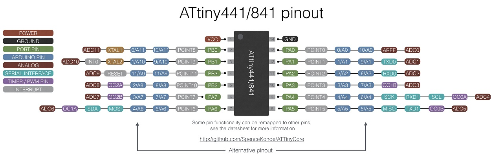
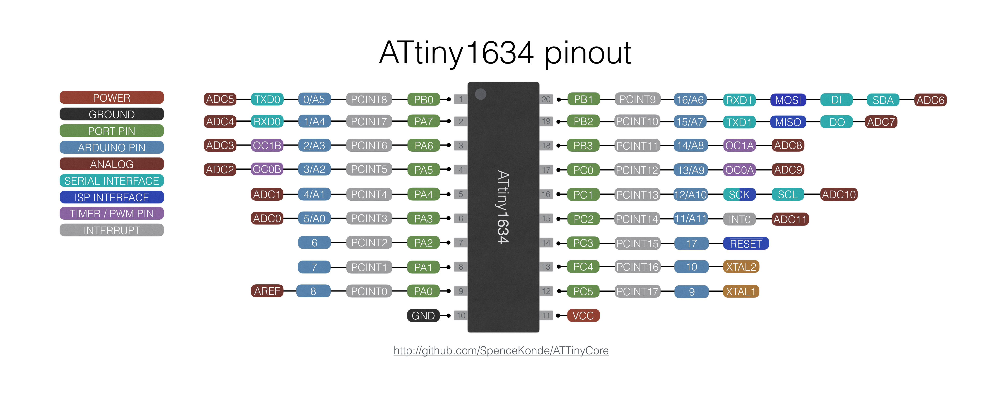
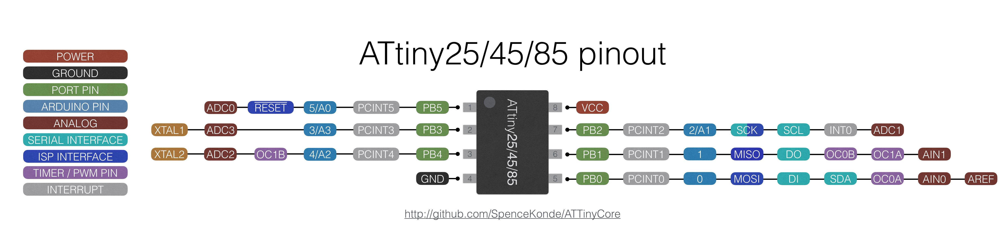
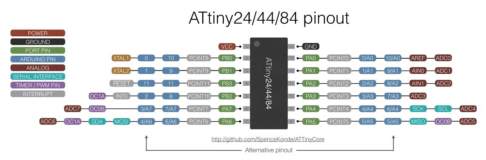
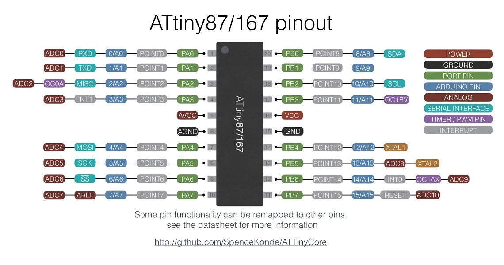
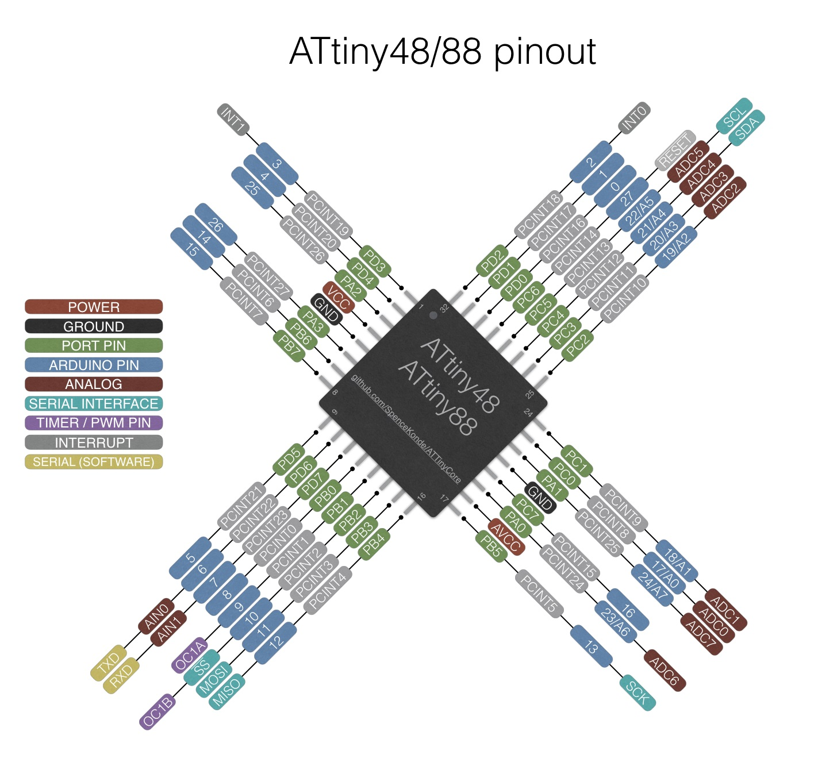
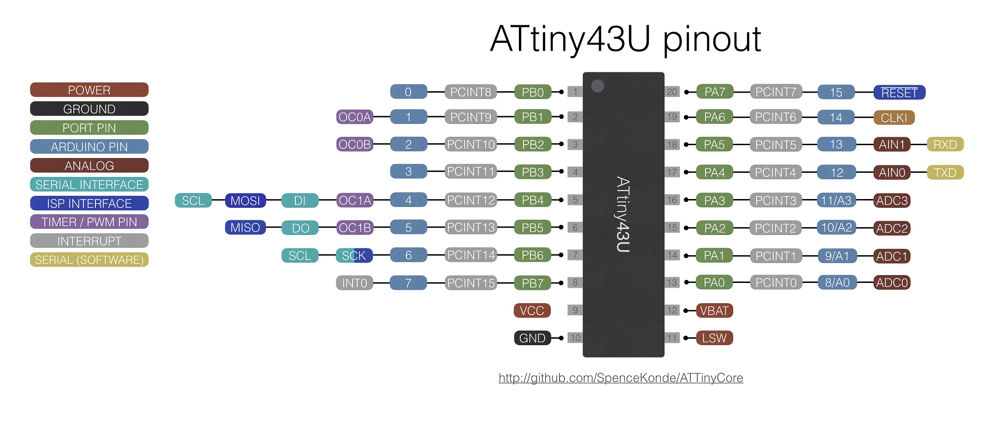

ATTiny Core - 1634, x313, x4, x41, x5, x61, x7, x8 and 828 for Arduino 1.6.5 and later (1.8.6+ strongly recommended, see gotchas section)
============

### Current recommended IDE version: 1.8.9 (1.8.10 introduced some new bugs)

### Read the first three guides - these explain the basics of installing ATTinyCore and using it with a supported ATtiny part
### [Installation](Installation.md)
### [Wiring and required external components](Wiring.md)
### [Programming Guide](Programming.md)
### [Migration Guide - moving to ATTinyCore from a different ATtiny board package](Migration.md)

## ATtinyCore Universal
This core supports the following processors - essentially every ATtiny processor that makes sense to use with Arduino. Click the processor name for part-specific information:

* [ATtiny2313, 4313](avr/extras/ATtiny_x313.md) (no bootloader)
* [ATtiny24, 44, 84](avr/extras/ATtiny_x4.md) (With or without Optiboot bootloader)
* [ATtiny25, 45, 85](avr/extras/ATtiny_x5.md) (With or without Optiboot bootloader)
* [ATtiny261, 461, 861](avr/extras/ATtiny_x61.md) (With or without Optiboot bootloader)
* [ATtiny87, 167](avr/extras/ATtiny_x7.md) (with or without Optiboot bootloader)
* [ATtiny48, 88](avr/extras/ATtiny_x8.md) (With or without Optiboot bootloader)
* [ATtiny441, 841](avr/extras/ATtiny_x41.md) (With or without Optiboot bootloader)
* [ATtiny1634](avr/extras/ATtiny_1634.md)  (With or without Optiboot bootloader)
* [ATtiny828](avr/extras/ATtiny_828.md) (With or without Optiboot bootloader)
* [ATtiny43](avr/extras/ATtiny_43.md) (no bootloader)

Variants of these are also supported (such as the ATtiny1634R, ATtiny2313A or ATtiny85V)

The megaAVR ATtiny parts (x12/x14/x16/x17/x02/x04/x06/x07) are be supported by https://github.com/SpenceKonde/megaTinyCore - they are sufficiently different from the classic AVR ATtiny parts that they need a separate core.

## Quick Gotcha list:

**This core includes part specific documentation - click the links above for your family of chips and READ IT** These describe issues and "gotchas" specific to certain chips. Be sure to review this documentation!

**There is a bug in the IDE that causes compilation errors with some combinations of boards and submenu options** on 1.8.5 and earlier on windows. The symptom of this is an error ending in something like C:\Users\yourusername\AppData\Local\Temp\arduino_build_131884/..\arduino_cache_186227\core\core_ATTinyCore_avr_attinyx4_LTO_enable,chip_84,clock_8internal,eesave_aenable,bod_disable,pinmapping_anew,millis_enabled,neopixelport_porta_1bc5d2d7fe299bbd4d4a668366e76c74.a: No such file or directory - this is caused by the way it includes all options in the name of the file; where there are many menu options, this will exceed the maximum file name length under windows. This issue impacts many parts on ATTinyCore 1.3.0 and later, and the 841/441 on ATTinyCore 1.2.2 and later. To fix this issue without downgrading ATTinyCore, update to 1.8.6 or later of the IDE - 1.8.9 or later is recommended (it is also the most recent version of the IDE which supports Windows XP)

**Windows store version sometimes experiences strange issues**. The windows store issues are difficult to reproduce on other systems, and no reliable solutions to them are currently known. We recommend using the .zip package or standard installer version of the IDE, not the Windows Store version.

**When uploading sketches via ISP using the Arduino IDE, you must select a programmer marked ATTiny from the programmers menu (or any other programmer added by an installed third party core) in order to upload properly to most supported chips - this is due to a limitation in the IDE.**

**When using a chip for the first time, or after changing the clock speed or BOD settings, you must do "burn bootloader" to set the fuses, even if you are not using the chip with a bootloader**

**free(): invalid next size (normal) error** This error is due to a bug in AVRdude ( https://savannah.nongnu.org/bugs/?48776 ) - and it's a spurious error, as when it is displayed, the programming operation has actually completed successfully (you can see for yourself by enabling verbose upload, and noting the successful write before this error is shown. It is unknown under what conditions this error appears, though it has been recorded on a USBTinyISP on Linux when bootloading an attiny88 with optiboot.

**When using analogRead(), use the A# constant to refer to the pin, not the digital pin number.** Analog channel number (see table in datasheet entry for ADMUX register) can also be used - unlike the official core, you can use analogRead() with the differential ADC channels (for example).

**When using I2C on anything other than the ATTiny48/88** you **must** use an I2C pullup resistor on SCL and SDA (if there isn't already one on the I2C device you're working with - many breakout boards include them). 4.7k or 10k is a good default value. On parts with real hardware I2C, the internal pullups are used, and this is sometimes good enough to work without external pullups; this is not the case for devices without hardware I2C (all devices supported by this core except 48/88) - the internal pullups can't be used here, so you must use external ones. **That said, for maximum reliability, you should always use external pullups, even on the t48/88**, as the internal pullups are not as strong as the specification requires.

**You cannot use the Pxn notation (ie, PB2, PA1, etc) to refer to pins** - these are defined by the compiler-supplied headers, and not to what an arduino user would expect. To refer to pins by port and bit, use PIN_xn (ex, PIN_B2); these are #defined to the Arduino pin number for the pin in question, and can be used wherever digital pin numbers can be used

**All ATTiny chips (as well as the vast majority of digital integrated circuits) require a 0.1uF ceramic capacitor between Vcc and Gnd for decoupling; this should be located as close to the chip as possible (minimize length of wires to cap). Devices with multiple Vcc pins, or an AVcc pin, should use a cap on those pins too. Do not be fooled by poorly written tutorials or guides that omit these. Yes, I know that in some cases (ex, the x5 series) the datasheet doesn't mention these - but other users as well as myself have had problems when it was omitted on a t85.**

**For low power applications, before entering sleep, remember to turn off the ADC (ADCSRA&=(~(1<<ADEN))) - otherwise it will waste ~270uA**

**When in power down sleep mode, the clock is stopped - using a slower clock speed does not save power while sleeping** I am asked very frequently about using very low clock speeds in low-power applications. Almost invariably, upon further interrogation, the user reveals that they plan to have the part in power-down sleep mode almost all the time. In this case, there is often little to be gained from running at a lower clock speed, since it only effects power use in the brief moments that the chip is awake - even more so because these moments may well be shorter when running at a higher clock speed. Clock speeds below 1MHz can present problems while programming due to the programmer using an SCK clock speed too fast for the target chip running at such a low system clock speed.

**When using the WDT as a reset source and NOT using a bootloader** remember that after reset the WDT will be enabled with minimum timeout. The very first thing your application must do upon restart is reset the WDT (`wdt_reset()`), clear WDRF flag in MCUSR (`MCUSR&=~(1<<WDRF)`) and then turn off or configure the WDT for your desired settings. If using the Optiboot bootloader, this is already done for you by the bootloader.

## ATTinyCore Features

### Bootloader Support (ATtiny 441/841, 44/84, 45/85, 461/861, 48/88, 828, 1634, 87, 167 only)

The Optiboot bootloader is included for the ATtiny 441, 841, 44, 84, 45, 85, 461, 861, 48, 88, 1634, 828, 87 and 167. For boards with a hardware UART, this runs at 57600 baud at 8mhz and slower, and  115200 baud above that; for boards without hardware UART, it runs at 19200 baud (on these boards TX/RX pins are the same as the builtin software serial, the ones marked AIN0 (TX) and AIN1(RX)). On boards with hardware serial, the bootloader uses UART0 or the LIN/UART as appropriate (bootloaders that use UART1 for devices that have a second UART are included, prefixed with "ser1" - you must flash them manually or modify boards.txt if you wish to use them). Once the bootloader is programmed, the target can be programmed over serial; the bootloader will run after reset, just like on a normal Arduino. Bootloaders are not included for the 2k-flash versions of these parts - more than a quarter of the available flash would go to the bootloader, and the Arduino abstraction is already severely constrained with just 2k of flash. For these parts, we recommend ISP programming. Clock speeds lower than 1MHz are not supported because the resulting baud rates would be so low that it some serial adapters start having problems talking to them. At 1MHz, uploads are painfully slow. We recommend using the bootloader only at 8MHz or higher. If you are trying to save power, it is usually better to run at 8MHz and put the chip to sleep for most of the time.

The ATtiny441/841, ATtiny1634, ATtiny44/84, ATtiny45/85, ATtiny461/861, ATtiny48/88 and the ATtiny x7 series do not have hardware bootloader support. To make the bootloader work, the "Virtual Boot" functionality of Optiboot is used. Because of this, another vector is used to point to point to the start of the applications - this interrupt cannot be used by the application - under the hood, the bootloader rewrites the reset and "save" interrupt vectors, pointing the save vector at the start of the program (where the reset vector would have pointed), and the reset vector to the bootloader (as there is no BOOTRST fuse). Up until version 1.2.0 of this core, the WDT vector was used for this purpose. In 1.2.0 and later, the EE_RDY vector (which is not used by anything in Arduino-land - the EEPROM library uses a busy-wait) is used instead. **If the bootloader was burned with 1.1.5 or earlier of this core, the WDT cannot be used to generate an interrupt** (WDT as reset source is fine) - re-burning bootloader with 1.2.0 or later will resolve this.

See the [Programming Guide](Programming.md) for more information on programming parts using Optiboot.

### Changing the ATtiny clock speed and other settings

Changing the ATtiny clock speed, B.O.D. settings etc, is easy. When an ATTinyCore board is selected from the Tools -> Board menu, there will appear extra submenus under Tools menu where we can set several ATtiny properties:

* Tools > Save EEPROM: (Boards without bootloader only - controls whether EEPROM is erased during a chip erase cycle)
* Tools > Timer 1 clock: (ATTiny25/45/85 only - allows timer1 to be clocked off the PLL for higher frequency PWM)
* Tools > LTO: (Link Time Optimization makes sketches smaller, but requires AVR boards 1.6.11 or later)
* Tools > B.O.D Level: (trigger voltage for Brown Out Detection - below this voltage, chip will be held in reset)
* Tools > Chip: (Select the part being used )
* Tools > Clock:  (Select the desired clock speed)
* Tools > B.O.D. Mode (active): (441, 841, 1634, 828 only - see B. O. D. section below)
* Tools > B.O.D. Mode (sleep): (441, 841, 1634, 828 only - see B. O. D. section below)

After changing the clock source, BOD settings, or whether to save EEPROM on chip erase), you must do "Burn Bootloader" with an ISP programmer. See [Programming Guide](Programming.md)

#### Supported clock speeds:
Supported clock speeds are shown in the menus in descending order of usefulness, ie, the popular clock speeds/sources are at the top, and the weird ones are at the bottom

Internal:
* 8 MHz
* 1 MHz
* 16 MHz (PLL clock,  x5, x61 only)
* 4 MHz*** (except on x313, starts up at 1MHz and immediately switches to 4MHz before setup() is run)
* 16.5MHz**** (PLL clock, tweaked, x5, x61 only - only use if you know you need this)
* 0.5 MHz** (x313 only)
* 512 kHz** (ULP - x41 only)
* 256 kHz** (ULP - x41 only)
* 128 kHz** (watchdog or ULP, all except 1643, 828)
* 64 kHz** (ULP - x41 only)
* 32 kHz** (ULP - 1634, 828, x41 only)

External crystal (all except 828, 43 and x8 series):
* 20 MHz
* 18.432 MHz*
* 16 MHz
* 14.7456 MHz*
* 12 MHz
* 11.0592 MHz*
* 9.216 MHz*
* 8 MHz
* 7.3728 MHz*
* 6 MHz
* 4 MHz

All available clock options for the selected processor will be shown in the Tools -> Clock menu.

Options marked with a * are "UART frequencies" - these divide evenly to common baud rates, so you can get a perfect match if this is required for your application - typical UART use cases do not require running at one of these UART frequencies. These are not available for chips without a UART in versions of ATTinyCore older than 1.1.5.

** **Warning** Options marked with ** are slow enough that many ISP programmers may not be able to program them. Depending on the ISP programmer (and in some cases the firmware on it), there may be a setting or jumper to slow the SCK frequency down for programming these parts, or it may automatically figure it out. The SCK frequency must be less than 1/6th of the system clock for ISP programming. Before using a such a low clock speed, consider whether you might be able to get lower power consumption by running at a higher base clock while staying in sleep most of the time - this results in fewer programming headaches, and in many (but not all) use cases results in comparable or lower power consumption.

*** The 4MHz internal option is useful if you are running near the minimum voltage - the lowest voltage for most of these parts is 1.8v, and at that voltage, they are only rated for 4MHz maximum.

`****` The 16.5MHz is specific to some digispark-related applications (though note that we do not support uploading via USB direct to a digispark) - see #349. Not recommended unless you understand that issue and know why you need it.

**Warning** When using weird clock frequencies (those other than 16MHz, 8MHz, 4MHz, 2MHz, 1MHz, 0.5MHz), micros() is 4-5 times slower (~110 clocks) (It reports the time at the point when it was called, not the end, however, and the time it gives is pretty close to reality - w/in 1% or so). This combination of performance and accuracy is the result of hand tuning for these clock speeds. For other clock speeds (for example, if you add your own), it will be slower still - hundreds of clock cycles - though the numbers will be reasonably accurate. millis() is not effected, only micros() and delay().

This differs from the behavior of official Arduino core - the "stock" micros() executes equally fast at all clock speeds, but simply returns wrong values for "weird" clock speeds.

#### Using external CLOCK on 48, 88, and 828 (new in 1.3.3)
These parts do not support using an external crystal. External Clock, however, is supported - this requires an external clock source (not just a crystal) connected to the CLKI pin. **DANGER** if this clock source is not present, you must supply a clock source to CLKI pin before it can be reprogrammed, including to use a different clock source. Unlike the parts which support a crystal, where this "potentially dangerous" clock option is not available in the menus because there are menu options for the supported speeds with a crystal as a clock source, so the procedure below can be used. On the 48/88/828, these menu options will enable the external CLOCK option. **This is not the same as external crystal - do not use this option if you are unsure about the difference between external clock and external crystal!**

#### Using external CLOCK (instead of crystal) on other parts
The use of an external clock - that is, a single wire with an appropriate clock signal is supplied to the XTAL1 pin from an external source, is possible using this core. This is an advanced feature, and is not supported directly through the IDE (except as noted above) to reduce the risk of people confusing it with external crystal and bricking their chips (if external clock is set as clock source when actually using external crystal, you must supply a clock signal on XTAL1 to program the chip again, including to set it to use a crystal again). To use an external clock:
1. Connect the chip, and ensure that the external clock source is present.
2. Select the desired clock speed with the external crystal option.
3. From File -> Preferences, ensure that "Show verbose output" is enabled for "uploading".
4. Connect your ISP programmer.
6. Choose "Burn Bootloader". This will set all the selected fuses, only it will be set to use a crystal (this is fine, the external clock will substitute this). However, at this point the XTAL2 pin will not be usable as GPIO.
7. Scroll up in the bottom pane of the IDE to the top of the upload output. The first line will be the avrdude command used to burn the bootloader. Copy this into a text editor. If the command includes -e, remove -e and everything after it. If it just points to the bootloader hex file, remove "-Uflash:w:(path to bootloader .hex file):i" from the end of the command.
8. Add -Ulfuse:w:0xF0:m to the end of the command.
9. Copy/paste this command into a command window, and hit return. Your chip should now be running on the external clock, and the XTAL2 pin (but not the XTAL1 pin) will be available for use normally.
10. When compiling for and uploading to your now-externally-clocked part, use the external crystal option corresponding to the clock speed you are using.

#### Determining clock speed and source from within the sketch
The clock speed is made available via the F_CPU #define - you can test this using #if macro

In version 1.3.3 and later, the clock source is also made available via the CLOCK_SOURCE #define. CLOCK_SOURCE can take one of the following values:

> 0 - Internal 8MHz oscillator (with or without prescaling to a speed lower than 8MHz)

> 1 - External Crystal

> 2 - External Clock (only available within the core on the 48, 88 and 828, as described above)

> 3 - Internal WDT oscillator  (not available on the x41, 1634, and 828)

> 4 - Internal ULP oscillator (available only on the x41, 1634, and 828)

> 5 - Internal 4MHz oscillator (present only on the x313 parts - if the 8MHz internal oscillator is prescaled to 4MHz, CLOCK_SOURCE will be 0, not 5)

> 6 - Internal PLL (x5 and x61 only)

### Assembler Listing generation

In version 1.2.2 and later, Sketch -> Export compiled binary will generate an assembly listing in the sketch folder; this is particularly useful when attempting to reduce flash usage, as you can see how much flash is used by different functions.

### Link-time Optimization (LTO) support

In version 1.1.2 and later, this core supports Link Time Optimization (lto). This can substantially reduce the compiled size of your sketch. Version 1.6.13 or later of the official AVR boards package (included with 1.6.11 and later of the IDE) is required for this functionality. Link time optimization can be enabled from the option in the tools menu.

### Makefile Support

For those who prefer to compile with a makefile instead of the IDE, sketches can be compiled with https://github.com/sudar/Arduino-Makefile - See the [makefile documentation](makefile.md) for more information on specific steps needed for this process.

### I2C support

On the following chips, I2C functionality can be achieved with the hardware USI. As of version 1.1.3 this is handled transparently via the special version of the Wire library included with this core. Be aware that USI-based I2C is not available when USI-based SPI is in use.
* ATtiny x5 (25/45/85)
* ATtiny x4 (24/44/84)
* ATtiny x61 (262/461/861)
* ATtiny x7 (87/167)
* ATtiny x313 (2313/4313)
* ATtiny 1634

On the following chips, slave I2C functionality is provided in hardware, but a software implementation must be used for master functionality. This is done automatically with the included Wire library. In versions prior to 1.2.2, USI on these devices is a flash-hog; this has been greatly improved in 1.2.2.
* ATtiny 828
* ATtiny x41 (441/841)

On the following chips, full master/slave I2C functionality is provided in hardware and the Wire library uses it:
* ATtiny x8 (48, 88)

### SPI support:

On the following chips, full SPI functionality is provided in hardware, and works identically to SPI on Atmega chips:
* ATtiny 828
* ATtiny x7 (87/167) (it has both a USI and full SPI, but the SPI library will use the SPI hardware)
* ATtiny x41 (441/841)
* ATtiny x8 (48, 88)

On the following chips, SPI functionality can be achieved with the hardware USI - as of version 1.1.3 of this core, this should be handled transparently via the SPI library. Take care to note that the **USI does not have MISO/MOSI, it has DI/DO**; when operating in master mode, DI is MISO, and DO is MOSI. When operating in slave mode, DI is MOSI and DO is MISO. The #defines for MISO and MOSI assume master mode (as this is much more common). Clock dividers 2, 4, 8 and >=14 are implemented as separate routines; **call `SPISettings` or `setClockDivider` with a constant value to use less program space**, otherwise, all routines will be included along with 32-bit math. Clock dividers larger than 14 are only approximate because the routine is optimized for size, not exactness. Also, interrupts are not disabled during data transfer as SPI clock doesn't need to be precise in most cases. If you use long interrupt routines or require consistent clocking, wrap calls to `transfer` in `ATOMIC_BLOCK`. Be aware that USI-based I2C is not available when USI-based SPI is in use.
* ATtiny x5 (25/45/85)
* ATtiny x4 (24/44/84)
* ATtiny x61 (262/461/861)
* ATtiny x7 (87/167)
* ATtiny x313 (2313/4313)
* ATtiny 1634

### Serial Support

On the following chips, full serial (UART) support is provided in hardware, as Serial (and Serial1 for parts with two serial ports):
* ATtiny x313 (2313/4313)
* ATtiny x7 (87/167 - LIN support, including a very fancy baud rate generator)
* ATtiny x41 (441/841 - two UARTs)
* ATtiny 1634 (two UARTs)
* ATtiny 828

On the following chips, **no hardware serial is available**, however, a built-in software serial named `Serial` is provided to maximize compatibility. This uses the analog comparator pins (to take advantage of the interrupt, since very few sketches/libraries use it, while lots of sketches/libraries use PCINTs). **TX is AIN0, RX is AIN1** -  This is a software implementation - as such, you cannot receive and send at the same time. If you try, you'll get gibberish, just like using SoftwareSerial.
* ATtiny x5 (25/45/85)
* ATtiny x4 (24/44/84)
* ATtiny x61 (261/461/861)
* ATtiny x8 (48/88)

This core is also fully compatible with the usual SoftwareSerial library if you want a software serial port on a different pin - however, you can still only transmit or receive on a single software serial instance at a time - on parts without hardware serial, this includes the builtin software serial "Serial" implementation noted above.

**Warning: Internal oscillator and Serial**
Note that when using the internal oscillator or pll clock, you may need to tune the chip (using one of many tiny tuning sketches) and set OSCCAL to the value the tuner gives you on startup in order to make serial (software or hardware) work at all - the internal clock is only calibrated to +/- 10% in most cases, while serial communication requires it to be within just a few percent. However, in practice, a larger portion of parts work without tuning than would be expected from the spec. That said, for the ATTiny x4, x5, x8, and x61 series I have yet to encounter a chip that was not close enough for serial using the internal oscillator at 3.3~5v at room temperature - This is consistent with the Typical Characteristics section of the datasheet, which indicates that the oscillator is fairly stable w/respect to voltage, but highly dependent on temperature.

The ATtiny x41 series, 1634R, and 828R have an internal oscillator factory calibrated to +/- 2% - but only at operating voltage below 4v. Above 4v, the oscillator gets significantly faster, and is no longer good enough for UART communications. The 1634 and 828 (non-R) are not as tightly calibrated (so they may need tuning even at 3.3v) and are a few cents less expensive, but suffer from the same problem at higher voltages. Due to these complexities, **it is recommended that those planning to use serial (except on a x41, 1634R or 828R at 2.5~3.3v) use an external crystal.**

A tuning sketch is planned for a future version of this core. (#139)

### ADC Support

All of the supported parts except for the x313 series have an Analog to Digital converter on chip. **Single-ended ADC inputs can be read using the ADC channel number or the Ax constant (they can NOT be read using the digital pin number)**. In addition to the single-ended input channels marked on the pinout diagrams, many also support differential ADC input channels. To use these, simply call analogRead() with the appropriate ADC channel number. To get the ADC channel number, refer to the datasheet - it is listed in the Register Description section of the chapter on the ADC, under the ADMUX register.''

### Timers and PWM
All of the supported parts have hardware PWM (timer with output compare functionality) on at least one pin. See the part-specific documentation pages for a chart showing which pins have PWM. In addition to PWM, the on-chip timers are also used for millis() (and other timekeeping functions) and tone() - as well as by many libraries to achieve other functionality. Typically, a timer can only be used for one purpose at a time.

On all supported parts, timekeeping functions are on timer0. On all parts except the tiny841/441 tone() is on timer1; on 841/441, in version 1.1.6 and later, tone() is on timer2 to improve compatibility (on 1.1.5 and earlier, tone() is on timer1 on all parts). This means that reconfiguring timer0 by manipulating it's registers will break millis() and delay(). Using tone() will prevent PWM from working on PWM pins controlled by timer1 (timer2 for 841/441), and manipulating it's registers will break tone(). Because tone() is now on timer2 on the 841/441, you can use tone() at the same time as other libraries that use timer1 (such as Servo, TimerOne, and many others).

Most of the ATTiny parts only have two timers. The attiny841 has a third timer - but be aware that it's timer2 is very different from the timer2 on the atmega328p and most other atmega parts - the '841 has a second 16-bit timer (identical to timer1), while the atmega parts usually have an 8-bit asynchronous timer. This means that libraries designed to use timer2 on the usual Arduino boards (ex, ServoTimer2) cannot be used with the 841.

### Built-in tinyNeoPixel library

The standard NeoPixel (WS2812/etc) libraries do not support all the clock speeds that this core supports, and some of them only support certain ports. This core includes two libraries for this, both of which are tightly based on the Adafruit_NeoPixel library, tinyNeoPixel and tinyNeoPixel_Static - the latter has a few differences from the standard library (beyond supporting more clocks speeds and ports), in order to save flash. At speeds below 16MHz, you must select the port containing the pin you wish to use from the Tools -> tinyNeoPixel Port menu. This code is not fully tested at "odd" clock speeds, but definitely works at 8/10/12/16/20 MHz, and will probably work at other speeds, as long as they are 7.3728 MHz or higher. See the [tinyNeoPixel documentation](avr/extras/tinyNeoPixel.md) and included examples for more information.

### B. O. D. (brown out detect) Configuration option

Brown-out detection continuously monitors Vcc, and holds the chip in reset state (BOR) if the applied voltage is below a certain threshold. This is a good idea with slow-rising power supplies or where it is expected that the supply voltage could droop below the required operating voltage for the frequency it is running at (see the speed grade specification for the part you're using) - without BOD enabled, this can put the chip into a hung state until manually reset. However, BOD increases power consumption slightly, and hence may be inappropriate in low power applications.

The BOD voltage trigger level can be chosen from the tools -> BOD menu. The ATTiny 441, 841, and 1634 support independently configuring the BOD mode (active, sampled, disabled) for active and sleep modes (see the applicable datasheet for details). These are configured via the Tools -> BOD Mode (sleep) and Tools -> BOD Mode (active) menus.

In all cases, the selected BOD option(s) is/are configured by the fuses, so after changing these, you must "burn bootloader" to set the fuses.

### Option to disable millis()/micros()

The Tools -> millis()/micros() allows you to enable or disable the millis() and micros() timers. If set to enable (the default), millis(), micros() will be available. If set to disable, these will not be available, Serial methods which take a timeout as an argument will not have an accurate timeout (though the actual time will be proportional to the timeout supplied); delay will still work. Disabling millis() and micros() saves flash, and eliminates the millis interrupt every 1-2ms; this is especially useful on parts with very limited flash, as it saves a few hundred bytes.

## Memory Lock Bits, disabling Reset

ATTinyCore will never set lock bits automatically, nor will it set fuses to disable reset or ISP programming (it is intentionally not made available as an option, since after doing that, an HVSP programmer is needed to further reprogram the chip, and inexperienced users would be at risk of bricking their chips this way). The usual workflow when these bits are in use is Set other fuses -> Upload -> Test -> set the lockbits and/or fuses. This can be done from the command line using AVRdude. To expedite the process, you can enable "Verbose Upload" in preferences, do "burn bootloader" (the board and/or programmer does not need to be present), scroll to the top of the output window - the first line is the avrdude command used to burn the bootloader, including the paths to all the relevant files. It can be used as a template for the command you execute to set the fuse/lock bits.

## Pin Mappings

### ATtiny 441/841

### ATtiny 1634

### ATtiny 828

### ATtiny 25/45/85

### ATtiny 24/44/84

### ATtiny 261/461/861

### ATtiny 87/167

### ATtiny 48/88

### ATtiny 2313/4313

### ATtiny 43U

Note that two pin mappings are supported for some devices to retain backwards compatibility with other cores - the pin mapping may be chosen from a menu.

Note that analog pin numbers (ex A0 ) cannot be used with digitalWrite()/digitalRead()/analogWrite() - all pins have a digital pin number. Analog pin number should only be used for analogRead() - this represents a departure from the behavior used in the official AVR boards. This enables us to expose the advanced ADC functionality available on some of the ATtiny parts with minimal impact, as clearly written code is unlikely to fall afoul of this anyway.

## Buy Breakout boards
Except for the x5, x4, x61, and x313 series, these are only available in surface mount packages. Breakout boards are available from my Tindie store (these are the breakout boards used for testing this core), which have the pins numbered to correspond with the pin numbers used in this core. Where applicable, all of these assembled boards have the bootloader installed, and all are set to run at the advertised speed (most are available with several speed/voltage combinations).
* 841: [Bare boards](https://www.tindie.com/products/DrAzzy/attiny84184-breakout/) - [Assembled Boards]( https://www.tindie.com/products/DrAzzy/attiny841-dev-board-woptiboot/ )
* 1634: [Bare boards](https://www.tindie.com/products/DrAzzy/attiny1634-breakout-wserial-header-bare-board/) - [Assembled Boards]( https://www.tindie.com/products/DrAzzy/attiny1634-dev-board-woptiboot-assembled/ )
* 828: [Bare boards](https://www.tindie.com/products/DrAzzy/atmega-x8attiny-x8828atmega-x8pb-breakout/) [Assembled Boards]( https://www.tindie.com/products/DrAzzy/attiny88-or-828-breakout-board-assembled/ )
* x61 series (861/461/261): [Bare boards](https://www.tindie.com/products/DrAzzy/attiny-16787861461261-breakout-bare-board/) [Assembled Boards](https://www.tindie.com/products/DrAzzy/attiny-861-or-167-development-board-assembled/)
* x7 series (167/87): [Bare boards](https://www.tindie.com/products/DrAzzy/attiny-16787861461261-breakout-bare-board/) [Assembled Boards](https://www.tindie.com/products/DrAzzy/attiny-861-or-167-development-board-assembled/)
* x8 series (48/88): [Bare boards](https://www.tindie.com/products/DrAzzy/atmega-x8attiny-x8828atmega-x8pb-breakout/) [Assembled Boards](https://www.tindie.com/products/DrAzzy/attiny88-or-828-breakout-board-assembled/)
* ATtiny43 breakout board (including boost converter) [Assembled Boards](https://www.tindie.com/products/16617/)
* SMD/DIP or DIP ATtiny 85 prototyping board: https://www.tindie.com/products/DrAzzy/attiny85-project-board/
* SMD or DIP ATtiny 84 prototyping board: https://www.tindie.com/products/DrAzzy/attiny84-project-board/

## Caveats

* Some people have problems programming the 841 and 1634 with USBAsp and TinyISP - but this is not readily reproducible. ArduinoAsISP works reliably. In some cases, it has been found that connecting reset to ground while using the ISP programmer fixes things (particularly when using the USBAsp with eXtremeBurner AVR) - if doing this, you must release reset (at least momentarily) after each programming operation. This may be due to bugs in USBAsp firmware - See this thread on the Arduino forums for information on updated USBAsp firmware: http://forum.arduino.cc/index.php?topic=363772 (Links to the new firmware are on pages 5~6 of that thread - the beginning is largely a discussion of the inadequacies of the existing firmware)
* At >4v, the speed of the internal oscillator on 828R, 1634R and 841 parts increases significantly - enough that serial (and hence the bootloader) does not work. It is recommended to run at 3.3v if using internal RC oscillator as a clock source - however, for these chips, a workaround is provided. This takes the form of a bootloader compiled assuming the chip is running a little fast, so that UART communication will work, and a matching board definition that tries to compensate by assuming the chip is running at 8.2mhz instead of 8. If you wish to handle tuning of the oscillator in your sketch (this means that serial won't work and timing will be off until you do something about it), you can use the 5v workaround as the bootloader but compile assuming 8mhz - select that option when you burn bootloader, but not when compiling and uploading. (New feature added in version 1.1.2)

## Acknowledgements

This core is based on TCWorld's ATTinyCore, which is in turn based on the arduino-tiny core here: http://code.google.com/p/arduino-tiny/
The ATtiny841 support is based on shimniok's ATTiny x41 core, and the 1634 support on Rambo's ATtiny 1634 core.
And of course - everything is based on the great work of the Arduino development team for creating the Arduino IDE and community which we all use.

The Board Manager package and Travis CI scripts were created by Per Tillisch (pert on Arduino forums), who provides similar assistance to a number of other cores, as well as being highly active on the Arduino forums with technical support.

The pinout diagrams are created by MCUdude (hansibull on Arduino forums), who maintains a number of excellent cores for supporting common ATmega processors - http://github.com/MCUdude

Many individuals have contributed various fixes and improvements via GitHub - see the [contributor list](https://github.com/SpenceKonde/ATTinyCore/graphs/contributors) for the full list.
