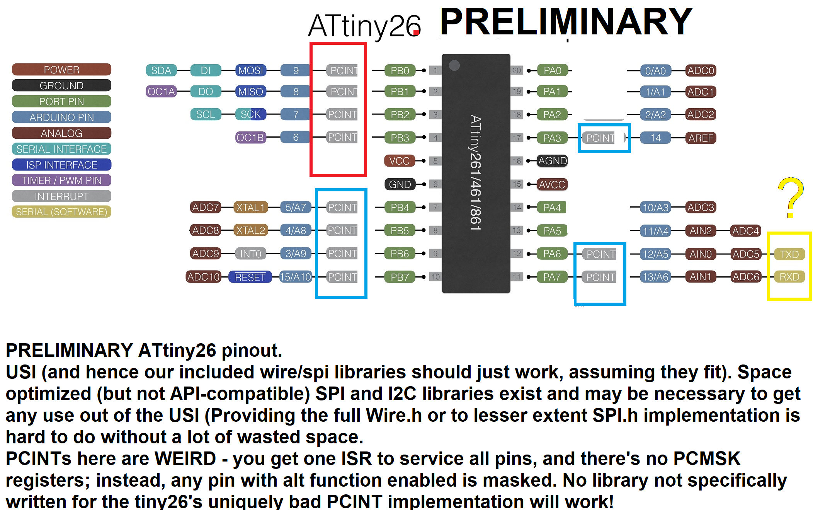

# ATtiny 26 - SUPPOT PLANNED BUT NOT YET AVAILABLE
;

Specifications |  .
------------ | -------------
Flash (program memory)   | 2048b
RAM  | 128 bytes
EEPROM | 128 bytes
Bootloader   | No, self programming is not supported on the ATtiny26.
GPIO Pins    | 16 (15 usable)
ADC Channels | 11
Differential ADC | Yes, 12 pairs, 4 of which are 20x for offset calculation, and a single 1x-only channel, all others 1x or 20x selectable.
PWM Channels | 2
Interfaces | USI, high speed timer
Clock options | Internal 1/8 MHz, Internal PLL at 16 MHz, external crystal, clock, or external RC (not supported) up to 20 MHz on ATtiny26, half those speeds on the ATtiny26L at lower voltage range.

Packages | DIP-20, SOIC-20, MLF-32

The ATtiny26 is the predecesor to the 261a/461a/861a and are functionally very similar; the tiny26 was one of the very first ATtiny parts so their functionality is less advanced but they do have a similar differential ADC. It has been not recommended for new designs since 2007 and is supported only on behalf of a paying client who is apparently in posessing of a large quantity of them, will be introduced in the 2.0.0 version of ATTinyCore.

## Programming
Any of these parts can be programmed by use of an ISP programmer. If using a version of Arduino prior to 1.8.13, be sure to choose a programmer with (ATTinyCore) after it's name (in 1.8.13 and later, only those will be shown), and connect the pins as normal for that ISP programmer.

### No bootloader is possible
Self programming is not supported on these parts, it wasn't until the next generation that tinies gained self programming.

## PLL Clock
The ATtiny x61-family parts have an on-chip PLL. This is clocked off the internal oscillator and nominally runs at 64 MHz when enabled. As a result, it is possible to clock the chip off 1/4th of the PLL clock speed, providing a 16 MHz clock option without a crystal (this has the same accuracy problems as the internal oscillator driving it). Alternately, or in addition to using it to derive the system clock, Timer1 can be clocked off the PLL. Previous versions of ATTinyCore provided this option on from a tools submenu, but it has been completely and totally broken in all released versions. Because manual configuration is straightforward this is is not optioned for this, nor any other part, in ATTinyCore 2.0.0

## Tone Support
Tone() uses Timer1. For best results, use pin 6 for tone - this will use Timer1's output compare unit to generate the tone, rather than generating an interrupt to toggle the pin. In this way, tones can be generated up into the MHz range

## I2C Support
There is no hardware I2C peripheral. I2C functionality can be achieved with the hardware USI. Thid is handled transparently via the special version of the Wire.h library included with this core. **You must have external pullup resistors installed** in order for I2C functionality to work at all, but the flash consumption is less than that of the straight Wire library would with hardware TWI.

## SPI Support
There is no hardware SPI peripheral. SPI functionality can be achieved with the hardware USI - as of version 1.1.3 of this core, this should be handled transparently via the SPI library. Take care to note that the USI does not have MISO/MOSI, it has DI/DO; when operating in master mode, DI is MISO, and DO is MOSI. When operating in slave mode, DI is MOSI and DO is MISO. The #defines for MISO and MOSI assume master mode (as this is much more common). What is marked on the pinout chart are the pins for ISP programming,.

## UART (Serial) Support
There is no hardware UART. If running off the internal oscillator, you may need to tune it to get the speed close enough to the correct speed for UART communication to work. The core incorporates a built-in software serial named Serial - this uses the analog comparator pins, in order to use the Analog Comparator's interrupt, so that it doesn't conflict with libraries and applications that require PCINTs.  TX is AIN0, RX is AIN1. Although it is named Serial, it is still a software implementation, so you cannot send or receive at the same time. The SoftwareSerial library may be used; if it is used at the same time as the built-in software Serial, only one of them can send *or* receive at a time (if you need to be able to use both at the same time, or send and receive at the same time, you must use a device with a hardware UART). While one should not attempt to particularly high baud rates out of the software serial port, [there is also a minimum baud rate as well](TinySoftSerialBaud.md)

To disable the RX channel (to use only TX), the following commands should be used after calling Serial.begin(). No special action is needed to disable the TX line if only RX is needed.
```
ACSR &= ~(1 << ACIE);
ACSR |= ~(1 << ACD);
```
## Servo Support
TBD

## ADC Features
The ATtiny26 has a surprisingly sophisticated ADC for it's time, being the first tinyAVR with a real differential ADC (which was not featured on any AVR released between 2016 and 2021 (the ones on the Dx-series domn't count). As of ATTinyCore 2.0.0, these are available through analogRead!  When used to read a pair of analog pins in differential mode, the ADC normally runs in unipolar mode: The voltage on the positive pin must be higher than that on the negative one, but the difference is measured to the full precision of the ADC. It can be put into bipolar mode, where the voltage on the negative side can go below the voltage on the positive side and generate meaningful measurements (it will return a signed value, which costs 1 bit of accuracy for the sign bit). This can be enabled by calling the helper function `setADCBipolarMode(true or false)`. On many AVR devices with a differential ADC, only bipolar mode is available.

## ADC Reference options
The ATtiny x61-series has two internal references, one of which can (optionally) use the AREF pin with an external capacitor for improved stability. It can also use an external reference voltage or the supply voltage. For historical reasons, there are several aliases available for some of these options.
| Reference Option   | Reference Voltage           | Uses AREF Pin        | Aliases/synonyms                         |
|--------------------|-----------------------------|----------------------|------------------------------------------|
| `DEFAULT`          | Vcc                         | No, pin available    |                                          |
| `EXTERNAL`         | Voltage applied to AREF pin | Yes, ext. voltage    |                                          |
| `INTERNAL2V56`     | Internal 2.56V reference    | No, pin available    | `INTERNAL2V56_NO_CAP` `INTERNAL2V56NOBP` |
| `INTERNAL2V56_CAP` | Internal 2.56V reference    | Yes, w/cap. on AREF  |                                          |
| ~INTERNAL1V1~      | NO Standard 1.1V reference! | N/A                  | You can read 1.18v bandgap. but not use as reference

This is the ONLY part I am aware of without an internal "1.1" (usually a bit higher) bandgap reference option for the ADC!

### Internal Sources
| Voltage Source  | Description                            |
|-----------------|----------------------------------------|
| ADC_INTERNAL1V1 | Reads the INTERNAL1V1 reference        |
| ADC_GROUND      | Reads ground - for offset correction   |

### Differential ADC
I don't know how they count the channels to the the headline "8" or "7" numbers. There are 20 differential options - 4 that measusire each of the possible negative pins are for offset adjustment at 20x gain only, 1 pair available with only 1x gain and all others available in in a 1x or 20x gain setting.


| Positive   | Negative   |   Gain  | Channel| Name 1x/20x mode | Notes            |
|------------|------------|---------|--------|------------------|------------------|
| ADC0 (PA0) | ADC1 (PA1) |     20x |   0x0B | DIFF_A0_A1_20X   |                  |
| ADC0 (PA0) | ADC1 (PA1) |      1x |   0x0C | DIFF_A0_A1_1X    |                  |
| ADC1 (PA1) | ADC1 (PA1) |     20x |   0x0D | DIFF_A1_A1_20X   | For offset       |
| ADC2 (PA2) | ADC1 (PA1) |     20x |   0x0E | DIFF_A2_A1_20X   |                  |
| ADC2 (PA2) | ADC1 (PA1) |      1x |   0x0F | DIFF_A2_A1_1X    |                  |
| ADC2 (PA2) | ADC3 (PA4) |      1x |   0x10 | DIFF_A2_A3_1X    |                  |
| ADC3 (PA4) | ADC3 (PA4) |     20x |   0x11 | DIFF_A3_A3_20X   | For offset       |
| ADC4 (PA5) | ADC3 (PA4) |     20x |   0x12 | DIFF_A4_A3_20X   |                  |
| ADC4 (PA5) | ADC3 (PA4) |      1x |   0x13 | DIFF_A4_A3_1X    |                  |
| ADC4 (PA5) | ADC5 (PA6) |     20x |   0x14 | DIFF_A4_A5_20X   |                  |
| ADC4 (PA5) | ADC5 (PA6) |      1x |   0x15 | DIFF_A4_A5_1X    |                  |
| ADC5 (PA6) | ADC5 (PA6) |     20x |   0x16 | DIFF_A5_A5_20X   | For offset       |
| ADC6 (PA7) | ADC5 (PA6) |     20x |   0x17 | DIFF_A6_A5_20X   |                  |
| ADC6 (PA7) | ADC5 (PA6) |      1x |   0x18 | DIFF_A6_A5_1X    |                  |
| ADC8 (PB5) | ADC9 (PB6) |     20x |   0x19 | DIFF_A8_A9_20X   |                  |
| ADC8 (PB5) | ADC9 (PB6) |      1x |   0x1A | DIFF_A8_A9_1X    |                  |
| ADC9 (PB6) | ADC9 (PB6) |     20x |   0x1B | DIFF_A9_A9_20X   | For offset       |
| ADC10(PB7) | ADC9 (PB6) |     20x |   0x1C | DIFF_A10_A9_20X  |                  |
| ADC10(PB7) | ADC9 (PB6) |      1x |   0x1D | DIFF_A10_A9_1X   |                  |

#### ADC Differential Pair Matrix

|  N\P  |   0   |   1   |   2   |   3   |   4   |   5   |   6   |   8   |   9   |  10   |
|-------|-------|-------|-------|-------|-------|-------|-------|-------|-------|-------|
|   0   |       |       |       |       |       |       |       |       |       |       |
|   1   | 1/20x |  20x  | 1/20x |       |       |       |       |       |       |       |
|   2   |       |       |       |       |       |       |       |       |       |       |
|   3   |       |       |   1x  |  20x  | 1/20x |       |       |       |       |       |
|   4   |       |       |       |       |       |       |       |       |       |       |
|   5   |       |       |       |       | 1/20x |  20x  | 1/20x |       |       |       |
|   6   |       |       |       |       |       |       |       |       |       |       |
|   9   |       |       |       |       |       |       |       | 1/20x |  20x  | 1/20x |

### Temperature Measurement
The ATtiny26 predates the usuakl temperature sensor, so no luck there.

## Interrupt Vectors
This table lists all of the interrupt vectors available on the ATtiny 26 as well as the name you refer to them as when using the `ISR()` macro. Be aware that, like on all other AVRs, a non-existent vector is just a "warning" not an "error" - however, the misspelled vector doesn't end up in the vector table, so if it is enabled and triggered, the device will (at best) immediately reset (often not cleanly). The catastrophic nature of the failure often makes debugging challenging. Vector addresses are "word addressed" (that is, 0x0001 is bytes 0x0002 and 0x0003). vect_num is the number you are shown in the event of a duplicate vector error, among other things.

**Note about PCINTs:**. There are `PCIE0` and `PCIE1` bits in `GIMSK` to enable PCINTs like normal. But the PCINTs are not divided by port (see colored boxes in preliminarey diagram) Like the x61 that followed it, and unlike anything more recent, both of them call the same PCINT vector when triggered: *there's ONLY ONE PCINT VECTOR!* and... **THERE ARE NO PCMSK REGISTERS EITHER** - which is almost a guarantee that no library will work without modification if it relies on PCINTs! Instead interrupts are masked only by enabling a peripheral/alternate furnction on that pin.

 # | Address | Vector Name          | Interrupt Definition
---|---------|----------------------|-------------
 0 |  0x0000 | RESET_vect           | Any reset (pin, WDT, power-on, BOD)
 1 |  0x0001 | INT0_vect            | External Interrupt Request 0
 2 |  0x0002 | PCINT_vect           | Pin Change Interrupt
 3 |  0x0003 | TIMER1_COMPA_vect    | Timer/Counter1 Compare Match A
 4 |  0x0004 | TIMER1_COMPB_vect    | Timer/Counter1 Compare Match B
 5 |  0x0005 | TIMER1_OVF_vect      | Timer/Counter1 Overflow
 6 |  0x0006 | TIMER0_OVF_vect      | Timer/Counter0 Overflow
 7 |  0x0007 | USI_START_vect       | USI Start
 8 |  0x0008 | USI_OVF_vect         | USI Overflow
 9 |  0x0009 | EE_RDY_vect          | EEPROM Ready
10 |  0x000A | ANA_COMP_vect        | Analog Comparator
11 |  0x000B | ADC_vect             | ADC Conversion Complete
12 |  0x000C | WDT_vect             | Watchdog Time-out (Interrupt Mode)
13 |  0x000D | INT1_vect            | External Interrupt Request 1
14 |  0x000E | TIMER0_COMPA_vect    | Timer/Counter0 Compare Match A
15 |  0x000F | TIMER0_COMPB_vect    | Timer/Counter0 Compare Match B
16 |  0x0010 | TIMER0_CAPT_vect     | Timer/Counter1 Capture Event
17 |  0x0011 | TIMER1_COMPD_vect    | Timer/Counter1 Compare Match D
18 |  0x0012 | FAULT_PROTECTION_vect| Timer/Counter1 Fault Protection
