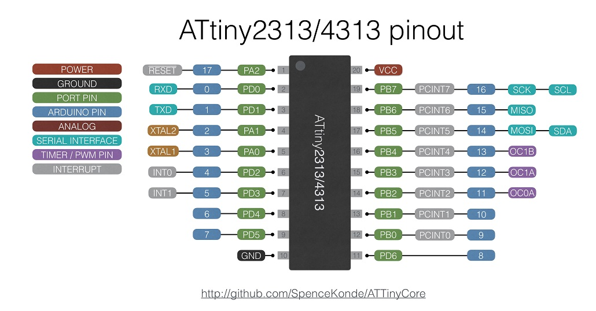

### ATtiny 2313/4313


 Specifications |  .
------------ | -------------
Flash (program memory)   | 2048b/4096b
RAM  | 128/256 bytes
EEPROM | 128/256 bytes
Bootloader | No
GPIO Pins | 17
ADC Channels | None
PWM Channels | 3
Interfaces | UART, USI
Clock options | Internal 0.5/1/4/8mhz, external crystal or clock* up to 20mhz

* Manual steps required. See notes in README under "Using external CLOCK (not crystal).

### Tone Support
Tone() uses timer1. For best results, use pin 12, and 13, as this will use the hardware output compare to generate the square wave instead of using interrupts. In order to use Tone(), you must select Initialize Secondard Timers: Yes

### Initialize Secondard Timers option
When an Arduino sketch runs, prior to Setup() being called, a hidden init() function is called to set up the hardware. One of the things it does is configure the timers. Timer0 (used for millis) is always configured, but on the x313 series, due to the extremely limited flash, it is optional whether to initialize Timer1. If Timer1 is not initialized, Tone() and PWM on pins 12 and 13 will not work.

### I2C Support
There is no hardware I2C peripheral. I2C functionality can be achieved with the hardware USI. As of version 1.1.3 this is handled transparently via the special version of the Wire library included with this core.

### SPI Support
There is no hardware SPI peripheral. SPI functionality can be achieved with the hardware USI - as of version 1.1.3 of this core, this should be handled transparently via the SPI library. Take care to note that the USI does not have MISO/MOSI, it has DI/DO; when operating in master mode, DI is MISO, and DO is MOSI. When operating in slave mode, DI is MOSI and DO is MISO. The #defines for MISO and MOSI assume master mode (as this is much more common).

### UART (Serial) Support
There is one full hardware Serial port, named Serial. It works the same as Serial on any normal Arduino - it is not a software implementation. Be aware that due to the limited memory on these chips the buffers are quite small.

To use only TX or only RX channel, after Serial.begin(), one of the following commands will disable the TX or RX channels
```
UCSRB &=~(1<<TXEN); // disable TX
UCSRB &=~(1<<RXEN); // disable RX
```

### There is no ADC
