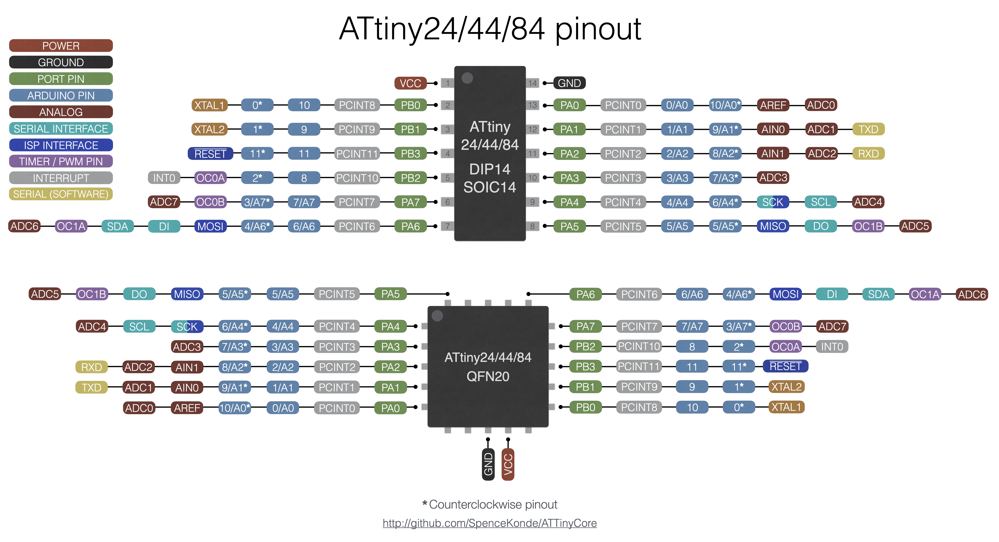

# ATtiny 24/44/84(a)


Specification         |    ATtiny84    |      ATtiny84  |    ATtiny84    |     ATtiny44   |       ATtiny44 |      ATtiny24  |
----------------------|----------------|----------------|----------------|----------------|----------------|----------------|
Bootloader (if any)   |                |       Optiboot |  Micronucleus  |                |       Optiboot |                |
Uploading Hardware    | ISP programmer | Serial Adapter | USB (directly) | ISP programmer | Serial Adapter | ISP programmer |
Flash available user  |     8192 bytes |     7552 bytes |     6522 bytes |     4096 bytes |     3456 bytes |           2048 |
RAM                   |      512 bytes |      512 bytes |      512 bytes |      256 bytes |      256 bytes |            128 |
EEPROM                |      512 bytes |      512 bytes |      512 bytes |      256 bytes |      256 bytes |            128 |
GPIO Pins             |     11 + RESET |     11 + RESET |     11 + RESET |     11 + RESET |     11 + RESET |     11 + RESET |
ADC Channels          |  12 (incl RST) |  12 (incl RST) |  12 (incl RST) |  12 (incl RST) |  12 (incl RST) |  12 (incl RST) |
Differential ADC      |     1/20x gain |     1/20x gain |     1/20x gain |     1/20x gain |     1/20x gain |     1/20x gain |
PWM Channels          |  4: PA5-7, PB2 |  4: PA5-7, PB2 |  4: PA5-7, PB2 |  4: PA5-7, PB2 |  4: PA5-7, PB2 |  4: PA5-7, PB2 |
Interfaces            |            USI |            USI |      vUSB, USI |            USI |            USI |            USI |
Clocking Options:     |         in MHz |         in MHz |         in MHz |         in MHz |         in MHz |         in MHz |
Int. Oscillator       |     8, 4, 2, 1 |     8, 4, 2, 1 |  Not supported |     8, 4, 2, 1 |     8, 4, 2, 1 |     8, 4, 2, 1 |
Internal, with tuning |    12.8, 12, 8 |    12.8, 12, 8 |    12.8, 12, 8 |    12.8, 12, 8 |    12.8, 12, 8 |    12.8, 12, 8 |
External Crystal      |   All Standard |   All Standard |  Not supported |   All Standard |   All Standard |   All Standard |
External Clock        |   All Standard |   All Standard |  Not supported |   All Standard |   All Standard |   All Standard |
Int. WDT Oscillator   |        128 kHz |        128 kHz |        128 kHz |        128 kHz |        128 kHz |        128 kHz |
Default Pin Mapping   |      Clockwise |      Clockwise |      Clockwise |      Clockwise |      Clockwise |      Clockwise |
LED_BUILTIN           |        PIN_PB2 |        PIN_PB2 |     PB2 or PB0 |        PIN_PB2 |        PIN_PB2 |        PIN_PB2 |


The 24/44/84 and 24a/44a/84a are functionally identical; the latter replaced the former in 2008, and uses slightly less power, and actual ATtiny84 parts are rarely seen in circulation today. They have the same signatures and are fully interchangible, except that the internal oscillator on the x4 not-A is worse (enough-so that the micronucleus bootloader may not be able to work on them). It is extremely common to refer to the ATtiny84a as an ATtiny84, and actual x4-not-A parts are exotic. Microchip still makes them, but charges a large premium for them to encourage people to migrate to less obsolete hardware.

These parts are available in DIP-14, SOIC-14, and 4mm x 4mm QFN-20.

Two pinouts are available for compatibility with other cores, see below for more information. Be sure you are using the pinout you think you are!

## Programming
Any of these parts can be programmed by use of any ISP programmer. 4k and 8k parts can be programmed over the software serial port using Optiboot, and 8k parts can be programmed via Micronucleus. Be sure to read the section of the main readme on the ISP programmers and IDE versions. 1.8.13 is recommended for best results.

### Optiboot Bootloader
This core includes an Optiboot bootloader for the ATtiny84/44, operating using software serial at at the standard ATTinyCore baud rates (which have changed in 2.0.0 for improved reliability see [the Optboot reference](./Ref_Optiboot.md)) - the software serial uses the AIN0 and AIN1 pins (see UART section below). The bootloader uses 640b of space, leaving 3456 or 7552b available for user code. In order to work on these parts, which do not have hardware bootloader support (hence no BOOTRST functionality), "Virtual Boot" is used. This works around this limitation by rewriting the vector table of the sketch as it's uploaded - the reset vector gets pointed at the start of the bootloader, while the EE_RDY vector gets pointed to the start of the application.

Due to a defect in Optiboot, it is possible for the bootloader to trash itself and the installed application; In this case ISP reprogramming is required to fix it. This means that **optiboot is not suitable for production systems on this part** - eventually, the bug will get triggered, and they will need to be rebootloaded; in a production setting this is simply not acceptable. I know an what must be done to fix this but getting from that to code which does that has proven extraordinarily difficult, I have attempted several times, each time reaching a point where I had no idea how to proceed to finish the fix. I know what value it needs to write to what address, but not  but have been unsuccessful figuring out how to implement it.

Optiboot is available for the 84 and 44. It takes up more than 1/4th of the flash on the 24, guaranteeing a miserable user experience.

### Micronucleus Bootloader
This core includes a Micronucleus bootloader that supports the ATtiny84A (it is not recommended for use on the tiny84-not-A), allowing sketches to be uploaded directly over USB. It runs at 8 MHz via the internal oscillator. For low power applications, it can be prescaled as listed in the table. See the document on [Micronucleus usage](Ref_Micronucleus.md) for more information. In order to achieve the 12 MHz clock during USB operation, the OSCCAL is drastically increased to 12MHz, but is set back down before running the sketch. USB libraries are not supported (yet). D- is on PIN_PB0, D+ is on PIN_PB1.

In 2.0.0, all of the usual micronucleus entry methods are available. It is shockingly robust considering the hackjob it is built upon.

Note that VUSB is only supported for loading code. After much very disappointing discussion with relevant experts and background research I am forced to say that VUSB is not supported for emulating other USB peripherals, as the hardware does not provide a means to meet the timing constraints in the context of an arduino sketch. Some people have gotten limited functionality to work. This is the exception not the rule.

### LED_BUILTIN is on PB2
Both optiboot and micronucleus will try to blink it to indicate bootloader status.

## Features

### Pin mapping options
Throughout the history of ATtiny Arduino support, two pin mappings have been used. Here, they are referred to descriptively: the clockwise, and counterclockwise pinout. The desired pin mapping can be chosen from the Tools -> Pin Mapping submenu. Be very sure that you have selected the one that you wrote your sketch for, as debugging these issues can be surprisingly timeconsuming. As of 1.4.0, your sketch can check for PINMAPPING_CCW or PINMAPPING_CW macro (eg, `#ifdef PINMAPPING_CCW` - I would recommend checking for the incompatible one, and immediately #error'ing if you find it). Alternately, also as of 1.4.0, with either pin mapping selected, you can always refer to pins by their port and number within that port, using the `PIN_Pxn` syntax - where x is the port letter, and n is the pin number, eg PIN_PA7 is PIN A7, which is pin 7 in the clockwise mapping and pin 3 in the counterclockwise mapping (don't use PIN_xn or Pxn). The clockwise mapping is strictly better - not only is it more coherent lgivally,

Example of a "guard" against wrong pin mapping:
```c
#ifdef PINMAPPING_CCW
#error "Sketch was written for clockwise pin mapping!"
#endif
```

All pin mapping options assume that PB2 has the LED (bootloaders will blink that pin, and LED_BUILTIN is defined as PIN_PB2), unless it's a micronucleus configuration with D+ on PB2, in which case it will instead use PB0.

### PWM frequency
TC0 is always run in Fast PWM mode: We use TC0 for millis, and phase correct mode can't be used on the millis timer - you need to read the count to get micros, but that doesn't tell you the time in phase correct mode because you don't know if it's upcounting or downcounting in phase correct mode.

| F_CPU  | F_PWM<sub>TC0</sub> | F_PWM<sub>TC1</sub>   | Notes                        |
|--------|---------------------|-----------------------|------------------------------|
| 1  MHz | 1/8/256=     488 Hz |  1/8/256=      488 Hz |                              |
| 2  MHz | 2/8/256=     977 Hz |  2/8/256=      977 Hz |                              |
| <4 MHz | x/8/256= 488 * x Hz |  x/8/512=  244 * x Hz | Phase correct TC1            |
| 4  MHz | 4/8/256=    1960 Hz |  4/8/512=      977 Hz | Phase correct TC1            |
| <8 MHz | x/64/256= 61 * x Hz |  x/8/512=  244 * x Hz | Between 4 and 8 MHz, the target range is elusive | Phase correct TC1 |
| 8  MHz | 8/64/256=    488 Hz |  8/64/256=     488 Hz |                              |
| >8 MHz | x/64/256= 61 * x Hz |  x/64/256=  61 * x Hz |                              |
| 12 MHz | 12/64/256=   735 Hz | 12/64/256=     735 Hz |                              |
| 16 MHz | 16/64/256=   977 Hz | 16/64/256=     977 Hz |                              |
|>16 MHz | x/64/256= 61 * x Hz |  x/64/512=  31 * x Hz | Phase correct TC1            |
| 20 MHz | 20/64/256=  1220 Hz | 20/64/512=     610 Hz | Phase correct TC1            |

Where speeds above or below a certain speed are specified, it's implied that the other end of the range is the next marked value. So >16 in that table is for 16-20 MHz clocks. The formula is given as a constant times x where x is expressed as MHz (the division above gets the time in megahertz - in the interest of readability I did not include the MHz to Hz conversion - I'm sure you all know how to multiply by a million)

Phase correct PWM counts up to 255, turning the pin off as it passes the compare value, updates it's double-buffered registers at TOP, then it counts down to 0, flipping the pin back as is passes the compare value. This is considered preferable for motor control applications, though the "Phase and Frequency Correct" mode is better if the period is ever adjusted by a large amount at a time, because it updates the doublebuffered registers at BOTTOM, and thus produces a less problematic glitch in the duty cycle, but doesn't have any modes that don't require setting ICR1 too.

For more information see the [Changing PWM Frequency](Ref_ChangePWMFreq.md) reference.

### Tone Support
Tone() uses Timer1. For best results, use PA6 and PA5, as this will use the hardware output compare to generate the square wave instead of using interrupts.

### Servo Support
The standard Servo library is hardcoded to work on specific parts only, we include a builtin Servo library that supports the Tiny x4 series. As always, while a software serial port (including the builtin one, Serial, on these ports, see below) is receiving or transmitting, the servo signal will glitch. See [the Servo/Servo_ATTinyCore library](../libraries/Servo/README.md) for more details. Like tone(), this will disable PWM on PA6 and PA6.

### I2C Support
There is no hardware I2C peripheral. I2C functionality can be achieved with the hardware USI. This is handled transparently via the special version of the Wire library included with this core. **You must have external pullup resistors installed** in order for I2C functionality to work at all. We only support use of the builtin universal Wire.h library. If you try to use other libraries and encounter issues, please contact the author or maintainer of that library - there are too many of these poorly written libraries for us to provide technical support for.

### SPI Support
There is no hardware SPI peripheral. SPI functionality can be achieved with the hardware USI. This should be handled transparently via the SPI library. Take care to note that the USI does not have MISO/MOSI, it has DI/DO; when operating in master mode, DI is MISO, and DO is MOSI. When operating in slave mode, DI is MOSI and DO is MISO. The #defines for MISO and MOSI assume master mode (as this is much more common, and the only mode that the SPI library has ever supported).

### UART (Serial) Support
There is no hardware UART. If running off the internal oscillator, you may need to calibrate it to get the speed close enough to the correct speed for UART communication to work. The core incorporates a built-in software serial named Serial - this uses the analog comparator pins, in order to use the Analog Comparator's interrupt, so that it doesn't conflict with libraries and applications that require PCINTs. TX is AIN0, RX is AIN1. Although it is named Serial, it is still a software implementation, so you cannot send or receive at the same time. The SoftwareSerial library may be used; if it is used at the same time as the built-in software Serial, only one of them can send *or* receive at a time (if you need to be able to use both at the same time, or send and receive at the same time, you must use a device with a hardware UART). While one should not attempt to particularly high baud rates out of the software serial port, [there is also a minimum baud rate as well](Ref_TinySoftSerial.md)

Though TX defaults to AIN0, it can be moved to any pin using Serial.setTxBit(b) where b is the number in the pin name using Pxn notation (in this case, also the arduino pin number) (2.0.0+ only - was broken in earlier versions)..

To disable the RX channel (to use only TX), select "TX only" from the Builtin SoftSerial tools menu. To disable the TX channel, simply don't print anything to it, and set it to the desired pinMode after Serial.begin()

## ADC Features
The ATtiny84 has a surprisingly sophisticated ADC with multiple differential channels and a gain of 1x or 20x. As of ATTinyCore 2.0.0, these are available through analogRead!  When used to read a pair of analog pins in differential mode, the ADC normally runs in unipolar mode: The voltage on the positive pin must be higher than that on the negative one, but the difference is measured to the full precision of the ADC. It can be put into bipolar mode, where the voltage on the negative side can go below the voltage on the positive side and generate meaningful measurements (it will return a signed value, which costs 1 bit of accuracy for the sign bit). This can be enabled by calling the helper function `setADCBipolarMode(true or false)`. On many AVR devices with a differential ADC, only bipolar mode is available.

### Reference options
* DEFAULT: Vcc
* EXTERNAL: Voltage applied to AREF pin
* INTERNAL1V1: Internal 1.1v reference
* INTERNAL: synonym for INTERNAL1V1

### Internal Sources
The following voltages can also be measured using the ADC
* ADC_INTERNAL1V1
* ADC_GROUND
* ADC_TEMPERATURE

### Differential ADC
There are 12 differential pairs available, all with selectable gain. On A0, A3, and A7, the positive and negative inputs can be set to the same pin; these can be used to determine the offset error in the gain stage, which can then be subtracted from future measurements. All pairs can have the two inputs swapped, too. ATTinyCore (v2.0.0+) allows you to read from them with `analogRead()` by using the channel names shown below. If it is required to know the numeric values of the channels, they are shown below as well. If you must work with channel numbers, instead of a names, when passing them to `analogRead()`, use the `ADC_CH()` macro (ex: `analogRead(ADC_CH(0x08))` to read ADC0 and ADC1 at 20x gain, equivalent to `analogRead(DIFF_A0_A1_20X)`), otherwise they will be interpreted as a (likely non-existent) digital pin (any time an analog channel is used, the high bit is set, and on numbers used for digital pins, it is not. So `ADC_CH()` is just `#define ADC_CH(x) (0x80 | (x))`  - but it's a heckova lot easier to understand when reading code). In the case of duplicates in the list of gain options, the one that does not use the `GSEL` bit to select the gain is named followed by an A (ex, `DIFF_A6_A5_20XA`).

### Differential ADC channels
|  Positive  |  Negative  |Gain 1x|Gain 20x| Name (1x Gain) | Name (20x Gain) |
|------------|------------|-------|--------|----------------|-----------------|
| ADC0 (PA0) | ADC0 (PA0) |       |  0x23  |                |  DIFF_A0_A0_20X |
| ADC0 (PA0) | ADC1 (PA1) | 0x08  |  0x09  |  DIFF_A0_A1_1X |  DIFF_A0_A1_20X |
| ADC0 (PA0) | ADC3 (PA3) | 0x0A  |  0x0B  |  DIFF_A0_A3_1X |  DIFF_A0_A3_20X |
| ADC1 (PA1) | ADC0 (PA0) | 0x28  |  0x29  |  DIFF_A1_A0_1X |  DIFF_A1_A0_20X |
| ADC1 (PA1) | ADC2 (PA2) | 0x0C  |  0x0D  |  DIFF_A1_A2_1X |  DIFF_A1_A2_20X |
| ADC1 (PA1) | ADC3 (PA3) | 0x0E  |  0x0F  |  DIFF_A1_A3_1X |  DIFF_A1_A3_20X |
| ADC2 (PA2) | ADC1 (PA1) | 0x2C  |  0x2D  |  DIFF_A2_A1_1X |  DIFF_A2_A1_20X |
| ADC2 (PA2) | ADC3 (PA3) | 0x10  |  0x11  |  DIFF_A2_A3_1X |  DIFF_A2_A3_20X |
| ADC3 (PA3) | ADC0 (PA0) | 0x2A  |  0x2B  |  DIFF_A3_A0_1X |  DIFF_A3_A0_20X |
| ADC3 (PA3) | ADC1 (PA1) | 0x2E  |  0x2F  |  DIFF_A3_A1_1X |  DIFF_A3_A1_20X |
| ADC3 (PA3) | ADC2 (PA2) | 0x30  |  0x31  |  DIFF_A3_A2_1X |  DIFF_A3_A2_20X |
| ADC3 (PA3) | ADC3 (PA3) | 0x24  |  0x25  |  DIFF_A3_A3_1X |  DIFF_A3_A3_20X |
| ADC3 (PA3) | ADC4 (PA4) | 0x12  |  0x13  |  DIFF_A3_A4_1X |  DIFF_A3_A4_20X |
| ADC3 (PA3) | ADC5 (PA5) | 0x14  |  0x15  |  DIFF_A3_A5_1X |  DIFF_A3_A5_20X |
| ADC3 (PA3) | ADC6 (PA6) | 0x16  |  0x17  |  DIFF_A3_A6_1X |  DIFF_A3_A6_20X |
| ADC3 (PA3) | ADC7 (PA7) | 0x18  |  0x19  |  DIFF_A3_A7_1X |  DIFF_A3_A7_20X |
| ADC4 (PA4) | ADC3 (PA3) | 0x32  |  0x33  |  DIFF_A4_A3_1X |  DIFF_A4_A3_20X |
| ADC4 (PA4) | ADC5 (PA5) | 0x1A  |  0x1B  |  DIFF_A4_A5_1X |  DIFF_A4_A5_20X |
| ADC5 (PA5) | ADC3 (PA3) | 0x34  |  0x35  |  DIFF_A5_A3_1X |  DIFF_A5_A3_20X |
| ADC5 (PA5) | ADC4 (PA4) | 0x3A  |  0x3B  |  DIFF_A5_A4_1X |  DIFF_A5_A4_20X |
| ADC5 (PA5) | ADC6 (PA6) | 0x1C  |  0x1D  |  DIFF_A5_A6_1X |  DIFF_A5_A6_20X |
| ADC6 (PA6) | ADC3 (PA3) | 0x36  |  0x37  |  DIFF_A6_A3_1X |  DIFF_A6_A3_20X |
| ADC6 (PA6) | ADC5 (PA5) | 0x3C  |  0x3D  |  DIFF_A6_A5_1X |  DIFF_A6_A5_20X |
| ADC6 (PA6) | ADC7 (PA7) | 0x1E  |  0x1F  |  DIFF_A6_A7_1X |  DIFF_A6_A7_20X |
| ADC7 (PA7) | ADC3 (PA3) | 0x38  |  0x39  |  DIFF_A7_A3_1X |  DIFF_A7_A3_20X |
| ADC7 (PA7) | ADC6 (PA6) | 0x3E  |  0x3F  |  DIFF_A7_A6_1X |  DIFF_A7_A6_20X |
| ADC7 (PA7) | ADC7 (PA7) | 0x26  |  0x27  |  DIFF_A7_A7_1X |  DIFF_A7_A7_20X |

#### ADC Differential Pair Matrix

 | N\P |  0 |  1 |  2 |  3 |  4 |  5 |  6 |  7 |
 |-----|----|----|----|----|----|----|----|----|
 |   0 |  X |  X |    |  X |    |    |    |    |
 |   1 |  X |    |  X |  X |    |    |    |    |
 |   2 |    |  X |    |  X |    |    |    |    |
 |   3 |  X |  X |  X |  X |  X |  X |  X |  X |
 |   4 |    |    |    |  X |    |  X |    |    |
 |   5 |    |    |    |  X |  X |    |  X |    |
 |   6 |    |    |    |  X |    |  X |    |  X |
 |   7 |    |    |    |  X |    |    |  X |  X |


By default, differential measurements are taken with the gain stage in "unipolar" mode; in order to get meaningful data, the positive side must be higher than the negative side. This is great if you you know ahead of time that one of them will definitely be higher (and often you do). But you can also use it in bipolar mode - in this mode there are 9 bits of resolution, plus a sign bit; by letting it go negative,

### Temperature Measurement
To measure the temperature, select the 1.1v internal voltage reference, and analogRead(ADC_TEMPERATURE); This value changes by approximately 1 LSB per degree C. This requires calibration on a per-chip basis to translate to an actual temperature, as the offset is not tightly controlled - take the measurement at a known temperature (we recommend 25C - though it should be close to the nominal operating temperature, since the closer to the single point calibration temperature the measured temperature is, the more accurate that calibration will be without doing a more complicated two-point calibration (which would also give an approximate value for the slope)) and store it in EEPROM (make sure that `EESAVE` fuse is set first, otherwise it will be lost when new code is uploaded via ISP) if programming via ISP, or at the end of the flash if programming via a bootloader (same area where oscillator tuning values are stored). See the section below for the recommended locations for these.s are stored). See the section below for the recommended locations for these.


## Purchasing ATtiny84 Boards
As the ATtiny84 is available in an easy-to-solder through-hole DIP package, a board can be easily made by just soldering the part into prototyping board.
I (Spence Konde) sell a specialized prototyping board that combines an ISP header with prototyping space and outlines to fit common SMD parts.
* [ATtiny84 prototyping board](https://www.tindie.com/products/drazzy/attiny84-project-board/)
* Micronucleus boards can be bought from one of my collaborators: [Micronucleus ATtiny84a](https://www.tindie.com/products/svdbor/tiniest-arduino-compatible-board-with-micronucleus/)

## Interrupt Vectors
This table lists all of the interrupt vectors available on the ATtiny x8-family, as well as the name you refer to them as when using the `ISR()` macro. Be aware that a non-existent vector is just a "warning" not an "error" (for example, if you misspell a vector name) - however, when that interrupt is triggered, the device will (at best) immediately reset (and not cleanly - I refer to this as a "dirty reset") The catastrophic nature of the failure often makes debugging challenging.

Note: The shown addresses below are "byte addressed" as that has proven more readily recognizable. The vector number is the number you are shown in the event of a duplicate vector error, as well as the interrupt priority (lower number = higher priority), if, for example, several interrupt flags are set while interrupts are disabled, the lowest numbered one would run first. Notice that INT0 is (as always) the highest priority interrupt. All of the parts  in this family are 8k or less flash, so they do not need to use 4-byte vectors.

| num | Address | Vector Name         | Interrupt Definition                |
|-----|---------|---------------------|-------------------------------------|
|   0 | 0x0000  |  RESET_vect         | Not an interrupt - this is a jump to the start of your code. |
|   1 | 0x0002  |  INT0_vect          | External Interrupt Request 0        |
|   2 | 0x0004  |  PCINT0_vect        | Pin Change Interrupt 0 (PORT A)     |
|   3 | 0x0006  |  PCINT1_vect        | Pin Change Interrupt 1 (PORT B)     |
|   4 | 0x0008  |  WDT_vect           | Watchdog Time-out (Interrupt Mode)  |
|   5 | 0x000A  |   ~TIM1_CAPT_vect~  | Timer/Counter1 Capture Event        |
|   5 | 0x000A  |  TIMER1_CAPT_vect   | Alias - provided by ATTinyCore      |
|   6 | 0x000C  |   ~TIM1_COMPA_vect~ | Timer/Counter1 Compare Match A      |
|   6 | 0x000C  |  TIMER1_COMPA_vect  | Alias - provided by ATTinyCore      |
|   7 | 0x000E  |   ~TIM1_COMPB_vect~ | Timer/Counter1 Compare Match B      |
|   7 | 0x000E  |  TIMER1_COMPB_vect  | Alias - provided by ATTinyCore      |
|   8 | 0x0010  |   ~TIM1_OVF_vect    | Timer/Counter1 Overflow             |
|   8 | 0x0010  |  TIMER1_OVF_vect    | Alias - provided by ATTinyCore      |
|   9 | 0x0012  |   ~TIM0_COMPA_vect~ | Timer/Counter0 Compare Match A      |
|   9 | 0x0012  |  TIMER0_COMPA_vect  | Alias - provided by ATTinyCore      |
|  10 | 0x0014  |   ~TIM0_COMPB_vect~ | Timer/Counter0 Compare Match B      |
|  10 | 0x0014  |  TIMER0_COMPB_vect  | Alias - provided by ATTinyCore      |
|  11 | 0x0016  |   ~TIM0_OVF_vect~   | Timer/Counter0 Overflow             |
|  11 | 0x0016  |  TIMER0_OVF_vect    | Alias - provided by ATTinyCore      |
|  12 | 0x0018  |  ANA_COMP_vect      | Analog Comparator                   |
|  13 | 0x001A  |  ADC_vect           | ADC Conversion Complete             |
|  14 | 0x001C  |  EE_RDY_vect        | EEPROM Ready                        |
|  16 | 0x001E  |  USI_STR_vect       | USI START                           |
|  17 | 0x0020  |  USI_OVF_vect       | USI Overflow                        |

## 84 vs 84a - you said "almost" fully interchangible?
Okay, there is one difference I'm aware of that makes them distinct: The 84 has the old, bifurcated calibration curve for the internal oscillator, that is, there is a discontinuite in the speed vs `OSCCAL` value as you increase the `OSCCAL` register from 127 to 128, the oscillator speed, which is generally above the nominal frequency at 127 will jump down to below it at 128 (though remaining higher than it was at `OSCCAL = 0`); Further increases to the cal register will then increase the speed again to it's maximum at 255 (which is generally higher than it was at 127). The "bifurcated" oscillator is generally less accurate and less stable than the newer design found on the ATtiny84A. This is most relevant with Micronucleus using the internal oscillator. Since the reliability of USB on VUSB-using parts depends on accuracy of the clock (USB is picky about timing) the A-version should work better. No testing was conducted with non-A parts, and they are now difficult to get legacy components (though supposedly still produced, they are sold at a heavy premium to encourage customers to use more modern parts). Because the vast majority of 84/84A parts have been 84As for many years, it has become very common for the parts to be called simply "ATtiny84" or "t84" when the writer is referring to the ATtiny84A.
