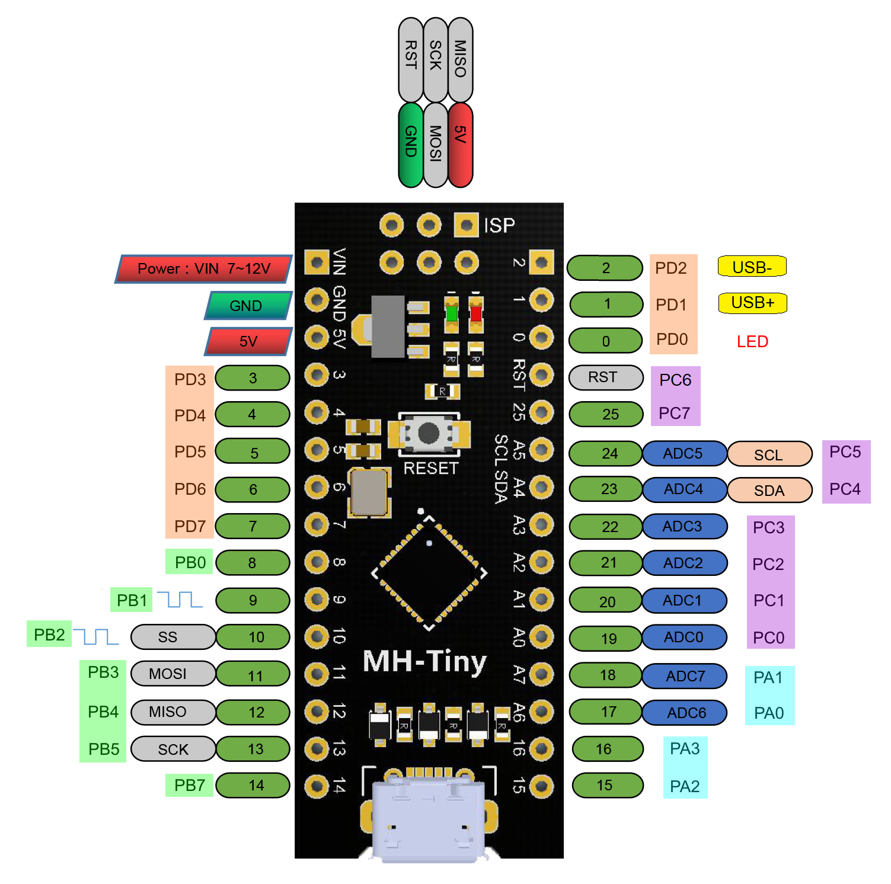

# ATtiny 48/88

Specification         |    ATtiny88    |       ATtiny88 |    ATtiny88    |      ATtiny48  |       ATtiny48 |
----------------------|----------------|----------------|----------------|----------------|----------------|
Bootloader (if any)   |                |       Optiboot |  Micronucleus  |                |       Optiboot |
Uploading uses        |   ISP/SPI pins | Serial Adapter | USB (directly) |   ISP/SPI pins | Serial Adapter |
Flash available user  |     8192 bytes |     7552 bytes |     6588 bytes |     4096 bytes |     3456 bytes |
RAM                   |      512 bytes |      512 bytes |      512 bytes |      256 bytes |      256 bytes |
EEPROM                |       64 bytes |       64 bytes |       64 bytes |       64 bytes |       64 bytes |
GPIO Pins             |     26 + RESET |     26 + RESET |     25 + RESET |     26 + RESET |     26 + RESET |
ADC Channels          |   8 (6 in DIP) |   8 (6 in DIP) |              8 |   8 (6 in DIP) |   8 (6 in DIP) |
PWM Channels          |      2 (9, 10) |      2 (9, 10) |      2 (9, 10) |      2 (9, 10) |      2 (9, 10) |
Interfaces            |       SPI, I2C |       SPI, I2C | vUSB, SPI, I2C |       SPI, I2C |       SPI, I2C |
Clocking Options:     |         in MHz |         in MHz |         in MHz |         in MHz |         in MHz |
Int. Oscillator       |     8, 4, 2, 1 |     8, 4, 2, 1 |  Not supported |     8, 4, 2, 1 |     8, 4, 2, 1 |
Int. WDT Oscillator   |        128 kHz |  Not supported |  Not supported |        128 kHz |  Not supported |
Internal, with tuning |          8, 12 |          8, 12 |  Not supported |          8, 12 |          8, 12 |
External Crystal      |  Not supported |  Not supported |  Not supported |  Not supported |  Not supported |
External Clock        |   All Standard |  All* Standard | **16**,8,4,2,1 |  All* Standard |   All Standard |
Default Pin Mapping   |       Standard |       Standard |        MH-Tiny |       Standard |       Standard |
LED_BUILTIN           |

`*` 20 MHz operation not supported. These parts are not even rated for 16!

USB only available at **BOLD** clock. Other frequencies when using Micronucleus are generated by prescaling this 16 MHz clock.  [Notes on this table](SpecificationConventions.md).

The ATtiny x8-family is intended as a low cost option compatible with the popular ATmega x8 series. As such, they have a nearly identical pinout (with a couple of extra GPIO pins in the TQFP version). Although these have the full hardware I2C and SPI peripherals, they lack both a hardware serial port and the option to use a crystal as a clock source. A Micronucleus board is available with a 16 MHz external CLOCK under the name "MH Tiny" (yes, that is overclocked, maximum is spec'ed at 12 MHz. But they seem to work under typical conditions though). They use a pin numbering scheme that differs significantly from the standard one; a pin mapping is provided which matches the markings on the board.

## Programming
Any of these parts can be programmed by use of any ISP programmer. 4k and 8k parts can be programmed over the software serial port using Optiboot, and 8k parts can be programmed via Micronucleus. Be sure to read the section of the main readme on the ISP programmers and IDE versions. 1.8.13 is recommended for best results.

### Optiboot Bootloader
This core includes an Optiboot bootloader for the ATtiny88/48, operating using software serial at 19200 baud - the software serial uses the AIN0 and AIN1 pins, marked on pinout chart (see also UART section below). The bootloader uses 640b of space, leaving 3456 or 7552b available for user code. In order to work on the 88/48, which does not have hardware bootloader support (hence no BOOTRST functionality), "Virtual Boot" is used. This works around this limitation by rewriting the vector table of the sketch as it's uploaded - the reset vector gets pointed at the start of the bootloader, while the EE_RDY vector gets pointed to the start of the application.

### Micronucleus Bootloader
The Micronucleus bootloader for these parts uses a 16 MHz external clock source. Boards are commercially available (and cheap) under the name MH-Tiny (also MH-ET and several other names). USB is on pins 1 and 2 (`PIN_PD1` and `PIN_PD2`, and the LED is on pin 0; there are slight differences in the numbering of pins. Additionally, the  As of 1.4.1, the new entry mode options detailed in [Using Micronucleus](Ref_Micronucleus.md) are available for the Tiny88 (MH-ET). Be aware that there are many bootloaders circulating, including the ones shipped with 1.4.0, which do not actually work on the MH-ET boards; if you have uploaded one of those, you can restore functionality by bootloading using an ISP programmer (provided you hadn't previously disabled reset, of course).

### Alternate pinout options
The MH Tiny boards have pins labeled with a different pin mapping. Pins up to 13 (all of PORTD and first 6 pins of PORTB) are the same, PB6 is not available because it is the clock input, and from there on out, order is different as well. The pinout can be selected from the Tools -> Pin Mapping submenu, regardless of which bootloader, if any, is in use. This way if you are (for example) using the MH-Tiny hardware, but programming it via ISP (for example) you can choose to use the pin mapping that matches the numbers printed on the board. The standard pin mapping is the default if not using Micronucleus bootloader; if using that, we of course default to the MH-Tiny pin mapping.

Pin Mapping  |  Standard x8   |     MH-Tiny   |
-------------|--------------- |---------------|
LED_BUILTIN  |  PB5 (pin 13)  | PD0 (pin 0)   |
Pins Missing |                | PB6 (ext clk) |
An = ADC chan|           Yes  |           Yes |

## Clock options
The ATtiny x8-family of microcontrollers, in the interest of lowering costs, does not provide support for using an external crystal as a clock source, only the internal oscillator (at ~8 or ~1 MHz) or an external *clock* source. The internal oscillator is only guaranteed to be within 10% of the targeted speed across the operating temperature and voltage range. At normal operating conditions (3.3-5.0V, room temperature) they are generally quite a bit closer, usually close enough for Serial (which is software serial here, as noted below) to work. .

### Using external CLOCK on 48/88
These parts do not support using an external crystal (cost savings - with 28 I/O pins, hardware I2C and SPI, and a headline price like this, some things had to give). External clock, however, is supported - this requires an external clock generator (not just a crystal) connected to PB6 (CLKI). These usually come in the shiny rectangular metal package (shielding, same as on crystals), only instead of 2 terminals, or 4 terminals of which 2 are unconnected, these are almost universally use all 4 pins - Vcc, Gnd, CLKOUT, and Enable; Enable is generally active-high, and internally weakly pulled up. Be aware that if you "burn bootloader" with an external clock selected, but you have actually connected a crystal, (they are virtually impossible to tell apart visually, except by positively identifying the part and hunting down the specs), the chip cannot be programmed until you give it a clock signal (you will get a signature mismatch, and if you enable verbose uploads, which you should do anyway, it will report the signature as 0x000000). This means removing what you hoped was an external clock, and connecting a clock signal to PB6 (a 2-8 MHz square wave would be appropriate; The included enhanced ArduinoAsISP++ sketch outputs such a signal on PB2 (digital pin 10) while burning the bootloader.

### Micronucleus clock options
Micronucleus is supported with an external 16 MHz external clock only. It may optionally be prescaled to 8, 4, or 1 MHz for low power applications; this is generated by prescaling the 16 MHz clock after the application starts, at these lower clock speeds, VUSB functionality is not supported. It is also less power efficient since the oscillator needs to keep running. For the same reason, the power savings possible through sleep are very limited (much of the savings from power down sleep are possible because the oscillator is turned off. Well, that's not happening here!.

### PWM frequency
TC0 is always run in Fast PWM mode: We use TC0 for millis, and phase correct mode can't be used on the millis timer - you need to read the count to get micros, but that doesn't tell you the time in phase correct mode because you don't know if it's upcounting or downcounting in phase correct mode.

| F_CPU  | No PWM from TC0     | F_PWMTC1   | Notes                        |
|--------|---------------------|-----------------------|------------------------------|
| 1  MHz |                   - |  1/8/256=      488 Hz |                              |
| 2  MHz |                   - |  2/8/256=      977 Hz |                              |
| <4 MHz |                   - |  x/8/512=  244 * x Hz | Phase correct TC1            |
| 4  MHz |                   - |  4/8/512=      977 Hz | Phase correct TC1            |
| <8 MHz |                   - |  x/8/512=  244 * x Hz | Between 4 and 8 MHz, the target range is elusive | Phase correct TC1 |
| 8  MHz |                   - |  8/64/256=     488 Hz |                              |
| >8 MHz |                   - |  x/64/256=  61 * x Hz |                              |
| 12 MHz |                   - | 12/64/256=     735 Hz |                              |
| 16 MHz |                   - | 16/64/256=     977 Hz |                              |
|>16 MHz |                   - |  x/64/512=  31 * x Hz | Phase correct TC1            |
| 20 MHz |                   - | 20/64/512=     610 Hz | Phase correct TC1            |

Phase correct PWM counts up to 255, turning the pin off as it passes the compare value, updates it's double-buffered registers at TOP, then it counts down to 0, flipping the pin back as is passes the compare value. This is considered preferable for motor control applications, though the "Phase and Frequency Correct" mode is better if the period is ever adjusted by a large amount at a time, because it updates the doublebuffered registers at BOTTOM, and thus produces a less problematic glitch in the duty cycle, but doesn't have any modes that don't require setting ICR1 too.

For more information see the [Changing PWM Frequency](Ref_ChangePWMFreq.md) reference.

### Tone Support
Tone() uses Timer1. For best results, use PB1 or PB2, as this will use the hardware output compare to generate the square wave instead of using interrupts. Using tone will disable PWM functionality (as timer1 is the only PWM capable timer on these parts)

### Servo Support
The standard Servo library is hardcoded to work on specific parts only, we include a builtin Servo library that supports the Tiny x8 series. As always, while a software serial port (including the builtin one, Serial, on these ports, see below) is receiving or transmitting, the servo signal will glitch. See [the Servo/Servo_ATTinyCore library](../libraries/Servo/README.md) for more details. Like tone(), this will disable PWM on PB1 or PB2. Tone and Servo cannot be used at the same time.

### I2C Support
There is full Hardware I2C! It is provided by Wire.h Do not attempt to use third party I2C libraries designed for ATtiny parts, they are designed for parts that have other hardware instead of a proper I2C port, that is not the case for these devices.

### SPI Support
There is full Hardware SPI! It is provided by SPI.h. Do not attempt to use third party SPI libraries designed for ATtiny parts, they are designed for parts that have other hardware instead of a proper SPI port, that is not the case for these devices.

### UART (Serial) Support
There is no hardware UART. The core incorporates a built-in software serial named Serial - this uses the analog comparator pins, in order to use the Analog Comparator's interrupt, so that it doesn't conflict with libraries and applications that require PCINTs.  TX is defaults to AIN0 (PD6), RX is always AIN1 (PD7). Although it is named Serial, it is still a software implementation, so you cannot send and receive at the same time. The SoftwareSerial library may be used; if it is used at the same time as the built-in software Serial, only one of them can send *or* receive at a time (if you need to be able to use both at the same time, or send and receive at the same time, you must use a device with a hardware UART).

If running off the internal oscillator (since this chip does not support a crystal), you may need to calibrate it to get the speed close enough to the correct speed for UART communication to work, though as noted above, this is rarely necessary under typical operating conditions. While one should not attempt to particularly high baud rates out of the software serial port, [there is also a minimum baud rate as well](Ref_TinySoftSerial.md)

Though TX defaults to AIN0, it can be moved to any pin on PORTD using Serial.setTxBit(b) where b is the number in the pin name using Pxn notation (only pins on PORTD are valid, and unless it is set for TX only, AIN1 (PD7) is not valid) (2.0.0+ only - was broken in earlier versions).

To disable the RX channel (to use only TX), select "TX only" from the Builtin SoftSerial tools menu. To disable the TX channel, simply don't print anything to it, and set it to the desired pinMode after Serial.begin()

## ADC Features
The ATtiny88 ADC is about as boring as they come. It's a standard 8-channel (6 on DIP or 28-pin QFN packages), one reference, temp sensor. Single-ended only. Basically what any x8 atmega has too, which is also incredibly uninspiring.

### ADC Reference options
Just two options on the t88/48. We recommend "INTERNAL1V1" to refer to that reference, as parts have multiple references of different voltages.
| Reference Option   | Reference Voltage           | Uses AREF Pin        |
|--------------------|-----------------------------|----------------------|
| `DEFAULT`          | Vcc                         | There is no AREF pin |
| `INTERNAL1V1`      | Internal 1.1V reference     | n/a                  |
| `INTERNAL`         | Alias of INTERNAL1V1        | n/a                  |

### Internal Sources

| Voltage Source  | Description                            |
|-----------------|----------------------------------------|
| ADC_INTERNAL1V1 | Reads the INTERNAL1V1 reference        |
| ADC_GROUND      | Reads ground - for offset measurement? |
| ADC_TEMPERATURE | Reads internal temperature sensor      |

### Temperature Measurement
To measure the temperature, select the 1.1v internal voltage reference, and analogRead(ADC_TEMPERATURE); This value changes by approximately 1 LSB per degree C. This requires calibration on a per-chip basis to translate to an actual temperature, as the offset is not tightly controlled - take the measurement at a known temperature (we recommend 25C - though it should be close to the nominal operating temperature, since the closer to the single point calibration temperature the measured temperature is, the more accurate that calibration will be without doing a more complicated two-point calibration (which would also give an approximate value for the slope)) and store it in EEPROM (make sure that `EESAVE` fuse is set first, otherwise it will be lost when new code is uploaded via ISP) if programming via ISP, or at the end of the flash if programming via a bootloader (same area where oscillator tuning values are stored). See the section below for the recommended locations for these.

## Tuning Constant Locations
These are the recommended locations to store tuning constants. In the case of OSCCAL, they are what are checked during startup  when a tuned configuration is selected.

ISP programming: Make sure to have EESAVE fuse set, stored in EEPROM

Optiboot used: Saved between end of bootloader and end of flash.

| Tuning Constant        | Location EEPROM | Location Flash |
|------------------------|-----------------|----------------|
| Temperature Offset     | E2END - 3       | FLASHEND - 5   |
| Temperature Slope      | E2END - 2       | FLASHEND - 4   |
| Tuned OSCCAL 12 MHz    | E2END - 1       | FLASHEND - 3   |
| Tuned OSCCAL 8 MHz     | E2END           | FLASHEND - 2   |
| Bootloader Signature 1 | Not Used        | FLASHEND - 1   |
| Bootloader Signature 2 | Not Used        | FLASHEND       |

Mironucleus used: Micronucleus boards are locked to the external clock, no oscillator calibration is possible.

| Tuning Constant        | Location Flash |
|------------------------|----------------|
| Temperature Offset     | FLASHEND - 1   |
| Temperature Slope      | FLASHEND       |

## Interrupt Vectors
This table lists all of the interrupt vectors available on the ATtiny x8-family, as well as the name you refer to them as when using the `ISR()` macro. Be aware that a non-existent vector is just a "warning" not an "error" (for example, if you misspell a vector name) - however, when that interrupt is triggered, the device will (at best) immediately reset (and not cleanly - I refer to this as a "dirty reset") The catastrophic nature of the failure often makes debugging challenging.

Note: The shown addresses below are "byte addressed" as that has proven more readily recognizable. The vector number is the number you are shown in the event of a duplicate vector error, as well as the interrupt priority (lower number = higher priority), if, for example, several interrupt flags are set while interrupts are disabled, the lowest numbered one would run first. Notice that INT0 is (as always) the highest priority interrupt. All of the parts  in this family are 8k or less flash, so they do not need to use 4-byte vectors.

num| Address|     Vector Name   | Interrupt Definition
---|--------|-------------------|--------------------------
0  | 0x0000 | RESET_vect        | Not an interrupt - this is a jump to the start of your code.
1  | 0x0002 | INT0_vect         | External interrupt request 0
2  | 0x0004 | INT1_vect         | External interrupt request 1
3  | 0x0006 | PCINT0_vect       | Pin Change Interrupt 0 (PORT A)
4  | 0x0008 | PCINT1_vect       | Pin Change Interrupt 1 (PORT B)
5  | 0x000A | PCINT2_vect       | Pin Change Interrupt 2 (PORT C)
6  | 0x000C | PCINT3_vect       | Pin Change Interrupt 3 (PORT D)
7  | 0x000E | WDT_vect          | Watchdog Time-out (Interrupt Mode)
8  | 0x0010 | TIMER1_CAPT_vect  | Timer/Counter1 capture event
9  | 0x0012 | TIMER1_COMPA_vect | Timer/Counter1 compare match A
10 | 0x0014 | TIMER1_COMPB_vect | Timer/Counter1 compare match B
11 | 0x0016 | TIMER1_OVF_vect   | Timer/Counter1 overflow
12 | 0x0018 | TIMER0_COMPA_vect | Timer/Counter0 compare match A
13 | 0x001A | TIMER0_COMPB_vect | Timer/Counter0 compare match B
14 | 0x001C | TIMER0_OVF_vect   | Timer/Counter0 overflow
15 | 0x001E | SPI_STC_vect      | SPI serial transfer complete
16 | 0x0020 | ADC_vect          | ADC conversion complete
17 | 0x0022 | EE_RDY_vect       | EEPROM ready
18 | 0x0024 | ANA_COMP_vect     | Analog comparator
19 | 0x0026 | TWI_vect          | 2-wire serial interface
