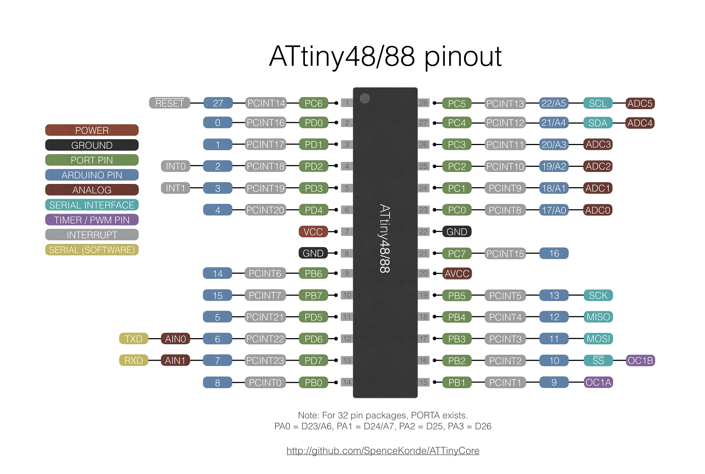

### ATtiny 48/88




 Specifications |  .
------------ | -------------
Flash (program memory)   | 4096b/8192b (3456b/7552b with optiboot)
RAM  | 256/512 bytes
EEPROM | 64 bytes
Bootloader |  Yes, Optiboot w/virtualboot
GPIO Pins | 27
ADC Channels | 8
PWM Channels | 4
Interfaces | SPI, I2C
Clock options | Internal 1/8mhz, external clock (no crystal) up to 20mhz

The ATtiny x8 series is intended as a low cost option compatible with the popular ATmega x8 series. As such, they have a nearly identical pinout (with a couple of extra GPIO pins in the TQFP version). Although these have the full hardware I2C and SPI peripherals, they lack both a hardware serial port and the option to use a crystal as a clock source.

### Optiboot Bootloader
This core includes an Optiboot bootloader for the ATtiny88/48, operating using software serial at 19200 baud - the software serial uses the AIN0 and AIN1 pins (see UART section below). The bootloader uses 640b of space, leaving 3456 or7552b available for user code. In order to work on the 88, which does not have hardware bootloader support (hence no BOOTRST functionality), "Virtual Boot" is used. This works around this limitation by rewriting the vector table of the sketch as it's uploaded - the reset vector gets pointed at the start of the bootloader, while the EE_RDY vector gets pointed to the start of the application.

Programming the ATTiny88/48 via ISP without the bootloader is fully supported.

### Clock options
The ATtiny x8 series of microcontrollers, in the interest of lowering costs, does not provide support for using an external crystal as a clock source, only the internal oscillator (at ~8 or ~1mhz) or an external *clock* source. The internal oscillator is only factory calibrated to +/- 10%, so for timing critical tasks, other arrangements (or a different chip) must be used.

While the +/- 10% accuracy is not close enough to guarantee UART serial will work (that requires ~2% accuracy), every chip I have tested at room temperature and 3.3 ~ 5v has been close enough to 8MHz for serial to work without calibration.

### Using external CLOCK on 48/88
These parts do not support using an external crystal. External clock, however, is supported - this requires an external clock source (not just a crystal) connected to the CLKI pin. **DANGER** if this clock source is not present, you must supply a clock source to CLKI pin before it can be reprogrammed, including to use a different clock source. **This is not the same as external crystal - do not use this option if you are unsure about the difference between external clock and external crystal!**

### I2C Support
There is full Hardware I2C support using Wire.h

### SPI Support
There is full Hardware SPI support using SPI.h

### UART (Serial) Support
There is no hardware UART support (for cost saving). The core incorporates a built-in software serial named Serial - this uses the analog comparator pins, in order to use the Analog Comparator's interrupt, so that it doesn't conflict with libraries and applications that require PCINTs.  TX is AIN0, RX is AIN1. Although it is named Serial, it is still a software implementation, so it is recommended to keep the baud rate low, and you cannot send or receive at the same time. The SoftwareSerial library may be used; if it is used at the same time as the built-in software Serial, only one of them can send *or* receive at a time (if you need to be able to use both at the same time, or send and receive at the same time, you must use a device with a hardware UART).

If running off the internal oscillator (since this chip does not support a crystal), you may need to calibrate it to get the speed close enough to the correct speed for UART communication to work, though as noted above, this is rarely necessary under typical operating conditions.

To disable the RX channel (to use only TX), the following commands should be used after calling Serial.begin(). No special action is needed to disable the TX line if only RX is needed.
```
ACSR &=~(1<<ACIE);
ACSR |=~(1<<ACD);
```

### ADC Reference options
* DEFAULT: Vcc
* INTERNAL1V1: Internal 1.1v reference
* INTERNAL: synonym for INTERNAL1V1

### Purchasing ATTiny828 Boards
I (Spence Konde / Dr. Azzy) sell ATtiny88 boards through my Tindie store - your purchases support the continued development of this core.


###[Assembled Boards](https://www.tindie.com/products/DrAzzy/attiny88-or-828-breakout-board-assembled/)
###[Bare Boards](https://www.tindie.com/products/DrAzzy/atmega-x8attiny-x8828atmega-x8pb-breakout/)
