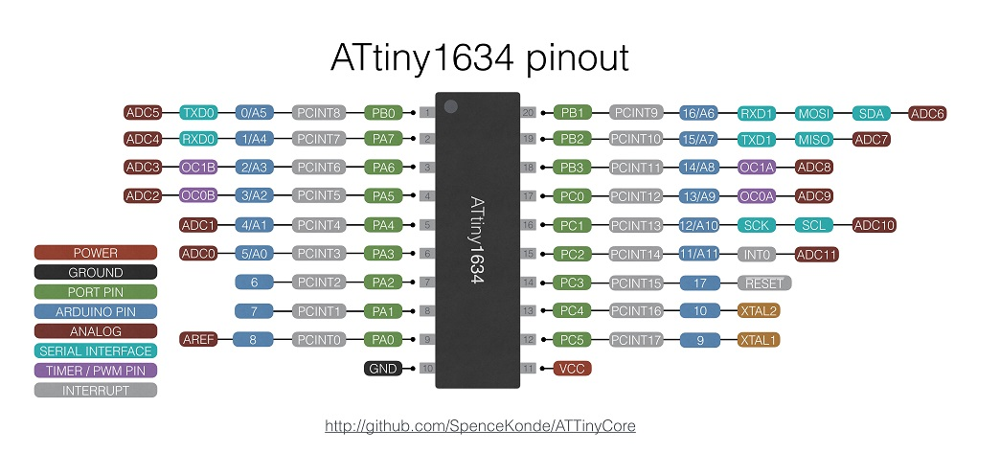

### ATtiny 1634


 Specifications |  .
------------ | -------------
Flash (program memory)   | 16384b ( 15744b with bootloader)
RAM  | 1024 bytes
EEPROM | 256 bytes
Bootloader | Yes, Optiboot w/Virtual Boot
GPIO Pins | 17
ADC Channels | 12
PWM Channels | 4
Interfaces | 2x UART, USI, slave I2C
Clock options | Internal 1/8MHz, external crystal or clock* up to 12MHz, overclocking to 16MHz.

* Manual steps required. See notes in README under "Using external CLOCK (not crystal).

### Warning: Pin 14 (PB3) does not work as an input unless watchdog timer is running
This is a design flaw in the chip, as noted in the datasheet errata.

### Optiboot Bootloader
This core includes an Optiboot bootloader for the ATtiny1634, operating on the hardware UART0 (Serial) port at 115200 baud for 12mhz or higher, or 57600 when running at lower speeds. In order to work on the 1634, which does not have hardware bootloader support (hence no BOOTRST functionality), "Virtual Boot" is used. This works around this limitation by rewriting the vector table of the sketch as it's uploaded - the reset vector gets pointed at the start of the bootloader, while the WDT vector gets pointed to the start of the application. As a consequence, the watchdog timer interrupt cannot be used if you're using the Optiboot bootloader (Watchdog reset still works), and the (sketch name)_bootloader.hex file generated via sketch -> Export Compiled Binary won't work. These issues are only relevant when programming through the bootloader. A version of the bootloader that operates on Serial1 is included in the bootloaders folder, though you will have to program it manually or modify boards.txt to use it.

### Internal Oscillator voltage dependence
The internal oscillator is factory calibrated to +/- 10% or +/- 2% for the slightly more expensive 1634R. +/- 2% is good enough for serial communication. However, this spec is only valid below 4v - above 4v, the oscillator runs significantly faster; enough so that serial communication does not work. This would interfere with uploads using the bootloader - to work around this, a version of Optiboot is included built assuming the slightly higher operating frequency; this will be used if you select the >4.0v operating voltage prior to doing Burn Bootloader. It is recommended to use a crystal when using the serial ports for this reason.

### I2C Support
There is no I2C master functionality implemented in hardware, however a USI is present that can be used with TinyWireM or other USI I2C library. I2C slave functionality is also available in hardware (use WireS library)

### SPI Support
There is no hardware SPI peripheral. The USI can be used to provide SPI support with one of the TinySPI libraries

### UART (Serial) Support
There are two hardware serial ports, Serial and Serial1. It works the same as Serial on any normal Arduino - it is not a software implementation.

To use only TX or only RX channel, after Serial.begin(), one of the following commands will disable the TX or RX channels (for Serial1, use UCSR1B instead)
```
UCSR0B&=~(1<<TXEN0); // disable TX
UCSR0B&=~(1<<RXEN0); // disable RX
```

### ADC Reference options
Note that **when using the Internal 1.1v reference, you must not apply an external voltage to AREF pin** - this sometimes appears to work, but other times results in erroneous ADC readings. Unlike some parts, there is no option to use the internal reference without the AREF pin being used.

* DEFAULT: Vcc
* EXTERNAL: External voltage applied to AREF pin
* INTERNAL1V1: Internal 1.1v reference, AREF may have added capacitor for improved ADC stability.
* INTERNAL: synonym for INTERNAL1V1

### Overclocking
Experience has shown that the ATTiny1634, operating at 5v and room temperature, will typically function at 16mhz without issue, although this is outside of the manufacturer's specification.

### Purchasing ATTiny1634 Boards
I (Spence Konde / Dr. Azzy) sell ATtiny1634 boards through my Tindie store - your purchases support the continued development of this core.


### [Assembled Boards](https://www.tindie.com/products/DrAzzy/attiny1634-dev-board-woptiboot-assembled/)

### [Bare Boards](https://www.tindie.com/products/DrAzzy/attiny1634-breakout-wserial-header-bare-board/)
