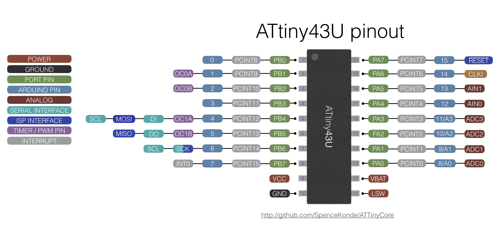

### ATtiny 43


 Specifications |  .
------------ | -------------
Flash (program memory)   | 4096b
RAM  | 256 bytes
EEPROM | 64 bytes
Bootloader | No
GPIO Pins | 15
ADC Channels | 4
PWM Channels | 4
Interfaces | USI
Special features | On-chip boost converter
Clock options | Internal 1/4/8MHz

The ATtiny43 is a very unusual microcontroller - the featureset is unremarkable, inferior to just about anything else in the ATtiny product line - except for one thing: A built-in boost converter that allows it to run off of just ~1.1v (startup - it will keep running as low as 0.7v) - so you can run a project off a single alkaline battery. It generates ~3v while in active mode, and can provide up to 30mA for peripherals. When using the boost converter, you must run at 4MHz or less. The "Internal 4MHz" option sets the fuses to start at 1MHz and then switches to 4MHz upon startup. See the datasheet for details of the layout, external components required, and further details of the boost converter operation.

### Boost Converter Capability
The boost converter will start up as long as the battery voltage is 1.2v or higher (in my testing, it seems to start at 1.1v), generating 3v. It will keep running as long as VBat is at least 0.8v, possibly even lower. It is capable of supplying 30mA to external devices as long as VBat > 1.0v (at lower VBat, the maximum current is lower - if overloaded, 3v output is not guaranteed)

### Tone Support
Tone() uses timer1. For best results, use pin 6 and 5, as this will use the hardware output compare to generate the square wave instead of using interrupts. This will take out PWM on pins 5 amd 6.

### I2C Support
There is no hardware I2C peripheral. I2C functionality can be achieved with the hardware USI. As of version 1.1.3 this is handled transparently via the special version of the Wire library included with this core.

### SPI Support
There is no hardware SPI peripheral. SPI functionality can be achieved with the hardware USI - as of version 1.1.3 of this core, this should be handled transparently via the SPI library. Take care to note that the USI does not have MISO/MOSI, it has DI/DO; when operating in master mode, DI is MISO, and DO is MOSI. When operating in slave mode, DI is MOSI and DO is MISO. The #defines for MISO and MOSI assume master mode (as this is much more common).

### UART (Serial) Support
There is no hardware UART support. If running off the internal oscillator, you may need to calibrate it to get the speed close enough to the correct speed for UART communication to work. The core incorporates a built-in software serial named Serial - this uses the analog comparator pins, in order to use the Analog Comparator's interrupt, so that it doesn't conflict with libraries and applications that require PCINTs.  TX is AIN0, RX is AIN1. Although it is named Serial, it is still a software implementation, so it is recommended to keep the baud rate low, and you cannot send or receive at the same time. The SoftwareSerial library may be used; if it is used at the same time as the built-in software Serial, only one of them can send *or* receive at a time (if you need to be able to use both at the same time, or send and receive at the same time, you must use a device with a hardware UART).

To disable the RX channel (to use only TX), the following commands should be used after calling Serial.begin(). No special action is needed to disable the TX line if only RX is needed.
```
ACSR &=~(1<<ACIE);
ACSR |=~(1<<ACD);
```

### ADC Reference options
* DEFAULT: Vcc
* INTERNAL1V1: Internal 1.1v reference
* INTERNAL: synonym for INTERNAL1V1


### Purchasing ATtiny43 Boards
I (Spence Konde / Dr. Azzy) sell ATtiny841 boards through my Tindie store - your purchases support the continued development of this core.
### [Assembled Boards](https://www.tindie.com/products/16617/)
### **Bare Boards** Coming soon
