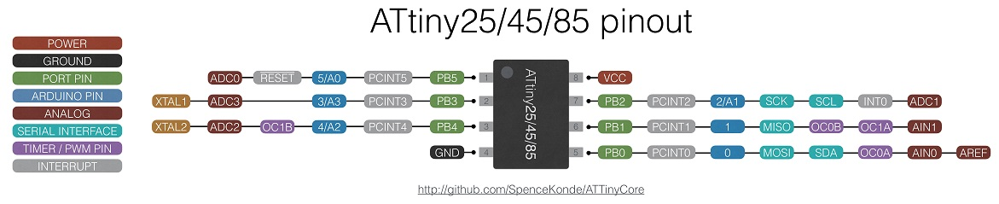

### ATtiny 25/45/85



 Specifications |  .
------------ | -------------
Flash (program memory)   | 2048b/4096b/8192b (3456b/7552b with Optiboot, 6586b with Micronucleus)
RAM  | 128/256/512 bytes
EEPROM | 128/256/512 bytes
Bootloader | Yes, Optiboot (serial) or Micronucleus (VUSB)
GPIO Pins | 5
ADC Channels | 4 (including the one on reset)
PWM Channels | 3
Interfaces | USI, high speed timer
Clock options | Internal 1/8MHz, Internal PLL at 16MHz or ~16.5MHz, external crystal or clock* up to 20MHz
Clock options | Micronucleus 16.5MHz Int. PLL (tuned) w/USB, 16/8/4/1 MHz w/out USB from 16 MHz Int. PLL

* Manual steps required. See notes in README under "Using external CLOCK (not crystal).


## Programming
Any of these parts can be programmed by use of any ISP programmer. If using a version of Arduino prior to 1.8.13, be sure to choose a programmer with (ATTinyCore) after it's name (in 1.8.13 and later, only those will be shown), and connect the pins as normal for that ISP programmer.

### Optiboot Bootloader
This core includes an Optiboot bootloader for the ATtiny85/45, operating using software serial at 19200 baud - the software serial uses the AIN0 and AIN1 pins, marked on pinout chart (see also UART section below). The bootloader uses 640b of space, leaving 3456 or 7552b available for user code. In order to work on the 85/45, which does not have hardware bootloader support (hence no BOOTRST functionality), "Virtual Boot" is used. This works around this limitation by rewriting the vector table of the sketch as it's uploaded - the reset vector gets pointed at the start of the bootloader, while the EE_RDY vector gets pointed to the start of the application.

### Micronucleus VUSB Bootloader
This core includes a Micronucleus bootloader that supports the ATtiny85, allowing sketches to be uploaded directly over USB. The board definition runs at 16.5 MHz via the internal PLL, adjusting the clock speed up slightly to get 16.5 MHz, and leaves it that way when the sketch is launched unless a slower clock speed is selected. These lower clock speeds are not compatible with USB libraries. See the document on [Micronucleus usage](UsingMicronucleus.md) for more information. D- is on pin 3, D+ is on pin 4.

**Currently the version of micronucleus supplied with ATTinyCore enters the bootloader upon power-on only. This will be made an option in future versions**

## Features

### PLL Clock
The ATtiny x5-family parts have an on-chip PLL. This is clocked off the internal oscillator and nominally runs at 64 MHz when enabled. It is possible to clock the chip off 1/4th of the PLL clock speed, providing a 16MHz clock option without a crystal (this has the same accuracy problems as the internal oscillator driving it). Alternately, or in addition to using it to derive the system clock, Timer1 can be clocked off the PLL. See below. For use with USB libraries, a 16.5 MHz clock option is available; with the Micronucleus bootloader, a tuned value calculated from the USB clock is used, and this is the default clock option, otherwise, a heuristic is used to determine the tuned speed.

### Timer1 Clock Source option
The ATtiny x5-family parts are equipped with a special high speed 8-bit timer, Timer1 (this is very different from the traditional 16-bit Timer1 used on the atmega328p and almost every other chip in the 8-bit AVR product line). This timer can be clocked off the system clock (default), OR from the PLL at 64 MHz or 32MHz - this is then fed into the prescaler, which can prescale it by any power of two from 1 to 16384. When opperating below 2.7v, the 64MHz PLL clock source option should not be used and may result in bad behavior. Changing this option will impact the frequency of PWM output on Pin 3, as well as the maximum frequency possible with tone(). See chapter 12 of the datasheet for more information on the high speed timer.

### Tone Support
Tone() uses Timer1. For best results, use pin 4 for tone - this will use Timer1's output compare unit to generate the tone, rather than generating an interrupt to toggle the pin. In this way, "tones" can be generated up into the MHz range. If Timer1 is set to use the PLL clock (provided this is done using the menu option, not manually), Tone will figure this out and output the requested frequency. With Timer1 running off the PLL @ 64MHz, tone() should be able to output a 32MHz signal on pin 4! If using SoftwareSerial or the builtin software serial "Serial", tone() will work on pin 4 (but not any other pins) while the software serial is active. Tone will disable PWM on pin 4, regardless of which pin is used for output. Starting in version 1.2.4, pin 1 will use hardware output compare for tone as well (but PWM on it will not be disabled when tone is in use on a different pin).

### I2C Support
There is no hardware I2C peripheral. I2C functionality can be achieved with the hardware USI. As of version 1.1.3 this is handled transparently via the special version of the Wire library included with this core.

### SPI Support
There is no hardware SPI peripheral. SPI functionality can be achieved with the hardware USI - as of version 1.1.3 of this core, this should be handled transparently via the SPI library. Take care to note that the USI does not have MISO/MOSI, it has DI/DO; when operating in master mode, DI is MISO, and DO is MOSI. When operating in slave mode, DI is MOSI and DO is MISO. The #defines for MISO and MOSI assume master mode (as this is much more common).

### UART (Serial) Support
There is no hardware UART. If running off the internal oscillator, you may need to calibrate it to get the speed close enough to the correct speed for UART communication to work. The core incorporates a built-in software serial named Serial - this uses the analog comparator pins, in order to use the Analog Comparator's interrupt, so that it doesn't conflict with libraries and applications that require PCINTs.  TX is AIN0, RX is AIN1. Although it is named Serial, it is still a software implementation, so you cannot send or receive at the same time. The SoftwareSerial library may be used; if it is used at the same time as the built-in software Serial, only one of them can send *or* receive at a time (if you need to be able to use both at the same time, or send and receive at the same time, you must use a device with a hardware UART). While one should not attempt to particularly high baud rates out of the software serial port, [there is also a minimum baud rate as well](TinySoftSerialBaud.md)

To disable the RX channel (to use only TX), the following commands should be used after calling Serial.begin(). No special action is needed to disable the TX line if only RX is needed.
```
ACSR &=~(1<<ACIE);
ACSR |=~(1<<ACD);
```

### Servo Support
As of version 1.2.2, the builtin Servo library supports the Tinyx5 series. As always, while a software serial port is receiving or transmitting, the servo signal will glitch (this includes the builtin software serial "Serial). This  On prior versions, a third party library must be used. The servo library will disable PWM on pin 4, regardless of which pin is used for output, and cannot be used at the same time as Tone.

### ADC Reference options
* DEFAULT: Vcc
* EXTERNAL: Voltage applied to AREF pin
* INTERNAL1V1: Internal 1.1v reference
* INTERNAL: synonym for INTERNAL1V1
* INTERNAL2V56: Internal 2.56v reference, with external bypass
* INTERNAL2V56_NO_CAP: Internal 2.56v reference, without external bypass
* INTERNAL2V56NOBP: Synonym for INTERNAL2V56_NO_CAP

## Purchasing ATtiny85 Boards
As the ATtiny85 is available in an easy-to-solder through-hole DIP package, a board can be easily made by just soldering the part into prototyping board.
I (Spence Konde) sell a specialized prototyping board that combines an ISP header with prototyping space and outlines to fit common SMD parts.
* [ATtiny85 prototyping board](https://www.tindie.com/products/drazzy/attiny85-project-board/)
* Micronucleus boards, and socketed boards for chips bootloaded with Micronucleus are readily available all over the internet, very cheaply, in several models. Search for things like "Digispark ATtiny85", "ATtiny85 USB" and so on.

## Interrupt Vectors
This table lists all of the interrupt vectors available on the ATtiny x5-family, as well as the name you refer to them as when using the `ISR()` macro. Be aware that a non-existent vector is just a "warning" not an "error" - however, when that interrupt is triggered, the device will (at best) immediately reset - and not cleanly either. The catastrophic nature of the failure often makes debugging challenging. Vector addresses are "word addressed". vect_num is the number you are shown in the event of a duplicate vector error, among other things.
vect_num | Vector Address | Vector Name | Interrupt Definition
------------ | ------------- | ------------ | -------------
0 | 0x0000 | RESET_vect | Any reset (pin, WDT, power-on, BOD)
1 | 0x0001 | INT0_vect | External Interrupt Request 0
2 | 0x0002 | PCINT0_vect | Pin Change Interrupt 0
3 | 0x0003 | TIMER1_COMPA_vect | Timer/Counter1 Compare Match A
4 | 0x0004 | TIMER1_OVF_vect | Timer/Counter1 Overflow
5 | 0x0005 | TIMER0_OVF_vect | Timer/Counter0 Overflow
6 | 0x0006 | EE_RDY_vect | EEPROM Ready
7 | 0x0007 | ANA_COMP_vect | Analog Comparator
8 | 0x0008 | ADC_vect | ADC Conversion Complete
9 | 0x0009 | TIMER1_COMPB_vect | Timer/Counter1 Compare Match B
10 | 0x000A | TIMER0_COMPA_vect | Timer/Counter0 Compare Match A
11 | 0x000B | TIMER0_COMPB_vect | Timer/Counter0 Compare Match B
12 | 0x000C | WDT_vect | Watchdog Time-out (Interrupt Mode)
13 | 0x000D | USI_START_vect | USI START
14 | 0x000E | USI_OVF_vect | USI Overflow
